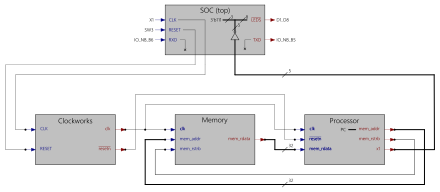

## Gatemate RISC-V Tutorial

### Description

&nbsp;

This repository contains the Verilog project folders for the popular FPGA tutorial ["From Blinker to RISCV"](https://github.com/BrunoLevy/learn-fpga/tree/master/FemtoRV/TUTORIALS/FROM_BLINKER_TO_RISCV) by BrunoLevy. The original tutorial has been adapted for the [Gatemate E1 FPGA evaluation board](https://www.colognechip.com/programmable-logic/gatemate-evaluation-board/) made by Cologne Chips. It describes a step-by-step implementation of the [FemtoRV](https://github.com/BrunoLevy/learn-fpga/tree/master/FemtoRV) softcore CPU, which is a minimalistic RISC-V CPU design written in Verilog.

Most of the tutorial steps require only a pushbutton and a set of LEDs, they can be easily completed using the Gatemate E1 evaluation board "stand-alone". Only later exercises interface with additional hardware that need extra connectivity. For example, the UART serial output introduced in step17 can be achieved with Digilents [PMOD USBUART](https://digilent.com/reference/pmod/pmodusbuart/start).

This tutorial adoption puts the Gatemate E1 on par with popular FPGA trainer boards that include the Digilent ARTY/CMOD-A7, Lattice ECP5-EVN/IceStick, Radiona ULX3S, or the 1Bitsquared IceBreaker.

Enjoy!

### Tutorial Steps

#### Prerequisites

- [Prerequisites 1](prerequisites-1.md) Getting FGPA build Tools
  - Gatemate E1 board
  - Cologne Chip toolchain
  - iVerilog
  - Verilator

#### Basic Verilog Code Blocks
- [Step01](step01) First blinky - Toolchain and Hardware Verification
- [Step02](step02) Clock Division and Delay Control (Gearbox)
- [Step03](step03) Block RAM - Using BRAM for loading bit patterns

#### RISC-V CPU Implementation Steps
- [Step04](step04) RISC-V CPU - Instruction Decoder
- [Step05](step05) RISC-V CPU - Register Bank and State Machine
- [Step06](step06) RISC-V CPU - Arithmetic Logic Unit (ALU)
- [Step07](step07) RISC-V CPU - Assembly Program in Verilog
- [Step08](step08) RISC-V CPU - Add JAL and JALR Jump Instructions
- [Step09](step09) RISC-V CPU - Add Branch Instructions
- [Step10](step10) RISC-V CPU - Add LUI and AUIPC Instructions
- [Step11](step11) RISC-V CPU - Separate Memory and CPU modules

Step11 Verilog module design

- [Step12](step12) RISC-V CPU - LUT Space Optimizations
- [Step13](step13) RISC-V CPU - Subroutines v1 (Gearbox to PLL)
- [Step14](step14) RISC-V CPU - PLL and subroutines v2 (ABI and pseudo-instructions)
- [Step15](step15) RISC-V CPU - Add LOAD Instructions
- [Step16](step16) RISC-V CPU - Add STORE Instructions
- [Step17](step17) RISC-V CPU - Add Memory-mapping and UART output
- [Step18](step18) RISC-V CPU - Computing the Mandelbrot set
- [Step19](step19) RISC-V CPU - Faster Simulation with Verilator

Step18 serial console output

#### Prerequisites

- [Prerequisites 2](prerequisites-2.md) Getting RISC-V build Tools
  - RISC-V toolchain (gcc compiler and tools to generate RISC-V binaries)
  - firmware_words (generates a hexadecimal machine code file for use with VERILOG's $readmemh())

#### RISC-V CPU Apps in Assembly and C
- [Step20](step20) RISC-V CPU - Run Assembly Programs from BRAM
- [Step21](step21) RISC-V CPU - Run 'C' Programs from BRAM
- [Step22](step22) RISC-V CPU - Run 'C' Program Data from SPI Flash Memory
- [Step23](step23) RISC-V CPU - Run 'C' Programs from SPI Flash Memory
- [Step24](step24) RISC-V CPU - 'C' Program Reset and Flash Storage Improvements

### Next Steps / Further Reading
Bruno Levy created the sequel tutorial ["Episode II"](https://github.com/BrunoLevy/learn-fpga/blob/master/FemtoRV/TUTORIALS/FROM_BLINKER_TO_RISCV/PIPELINE.md) that improves the RISC-V CPU design into a pipelined CPU. This requires a FPGA with at least 128kB BRAM. The DS1001 datasheet for Gatemate's CCGM1A1 FPGA specifies 1,310,720 bits (163KB) BRAM, organized in 32 SRAM blocks that are configurable either as 20Kbit or 40Kbit blocks. This sounds promising ...

Almost all content is Copyright (c) 2020-2021, Bruno Levy All rights reserved. ([License](https://github.com/BrunoLevy/learn-fpga/blob/master/FemtoRV/LICENSE.md))
Small adoption changes fall under the same license.

Tokyo, August 2023
