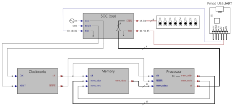

## Step11 - Gatemate RISC-V Tutorial

### Description

This folder is step11 of the popular FPGA tutorial ["From Blinker to RISCV"](https://github.com/BrunoLevy/learn-fpga/tree/master/FemtoRV/TUTORIALS/FROM_BLINKER_TO_RISCV) by BrunoLevy.

Step11 separates the SOC components into separate modules for processor and memory.

The Memory module interface gets the clk signal, mem_addr, and mem_rstrb inputs. Whenever the processor wants to read from memory, it sends the address to be read into mem_addr, then raises mem_rstrb to 1. This instructs the Memory module to return the data for mem_addr to be put into the mem_rdata output.

The Processor module has the mem_addr and mem_rstrb signal (as outputs), the mem_rdata signal (as input). We also externalize the x1 register (as output) that can be used for visual debugging, and plug it to the LEDs.



For now we keep the SOC, Memory and Processor modules inside the same single file SOC.v. To test the CPU, the same assembly program from step09 is stored into Memory, which implements a counter. The board LEDs show the counter.

```verilog
`include "../rtl-shared/riscv_assembly.v"
   integer L0_=8;
   initial begin
      ADD(x1,x0,x0);
      ADDI(x2,x0,31);
   Label(L0_);
      ADDI(x1,x1,1);
      BNE(x1, x2, LabelRef(L0_));
      EBREAK();
      endASM();
   end
```

### Build FPGA Bitstream

```
$ make
/home/fm/oss-cad-suite/bin/yosys -ql log/synth.log -p 'read -sv SOC.v ../rtl-shared/clockworks.v ../rtl-shared/pll_gatemate.v; synth_gatemate -top SOC -luttree -nomx8 -vlog net/SOC_synth.v; write_json net/SOC_synth.json'
test -e ../gatemate-e1.ccf || exit
/home/fm/oss-cad-suite/bin/nextpnr-himbaechel --device=CCGM1A1 --json net/SOC_synth.json --write net/SOC_impl.v -o out=net/SOC_impl.txt -o ccf=../gatemate-e1.ccf --router router2 > log/impl.log
Info: Using uarch 'gatemate' for device 'CCGM1A1'
Info: Using timing mode 'WORST'
Info: Using operation mode 'SPEED'
...
Info: Device utilisation:
Info: 	            USR_RSTN:       0/      1     0%
Info: 	            CPE_COMP:       0/  20480     0%
Info: 	         CPE_CPLINES:       5/  20480     0%
Info: 	               IOSEL:      12/    162     7%
Info: 	                GPIO:      12/    162     7%
Info: 	               CLKIN:       1/      1   100%
Info: 	              GLBOUT:       1/      1   100%
Info: 	                 PLL:       0/      4     0%
Info: 	            CFG_CTRL:       0/      1     0%
Info: 	              SERDES:       0/      1     0%
Info: 	              CPE_LT:     748/  40960     1%
Info: 	              CPE_FF:      61/  40960     0%
Info: 	           CPE_RAMIO:     251/  40960     0%
Info: 	            RAM_HALF:       3/     64     4%
...
Info: Program finished normally.
/home/fm/oss-cad-suite/bin/gmpack --input net/SOC_impl.txt --bit SOC.bit
```
### Simulation
```
$ make test
Running testbench simulation
test ! -e SOC.tb || rm SOC.tb
test ! -e SOC.vcd || rm SOC.vcd
/home/fm/oss-cad-suite/bin/iverilog -DBENCH -o SOC.tb -s SOC_tb SOC_tb.v SOC.v ../rtl-shared/clockworks.v ../rtl-shared/pll_gatemate.v
/home/fm/oss-cad-suite/bin/vvp SOC.tb
Label:          8
ALUreg rd= 1 rs1= 0 rs2= 0 funct3=000
x1 <= 00000000000000000000000000000000
ALUimm rd= 2 rs1= 0 imm=31 funct3=000
x2 <= 00000000000000000000000000011111
ALUimm rd= 1 rs1= 1 imm=1 funct3=000
x1 <= 00000000000000000000000000000001
LEDS = 11111110
BRANCH rs1=1 rs2=2
ALUimm rd= 1 rs1= 1 imm=1 funct3=000
x1 <= 00000000000000000000000000000010
LEDS = 11111101
BRANCH rs1=1 rs2=2
ALUimm rd= 1 rs1= 1 imm=1 funct3=000
x1 <= 00000000000000000000000000000011
LEDS = 11111100
BRANCH rs1=1 rs2=2
ALUimm rd= 1 rs1= 1 imm=1 funct3=000
x1 <= 00000000000000000000000000000100
LEDS = 11111011
BRANCH rs1=1 rs2=2
ALUimm rd= 1 rs1= 1 imm=1 funct3=000
x1 <= 00000000000000000000000000000101
LEDS = 11111010
BRANCH rs1=1 rs2=2
ALUimm rd= 1 rs1= 1 imm=1 funct3=000
x1 <= 00000000000000000000000000000110
LEDS = 11111001
BRANCH rs1=1 rs2=2
ALUimm rd= 1 rs1= 1 imm=1 funct3=000
x1 <= 00000000000000000000000000000111
LEDS = 11111000
Target LED state reached. Ending...
SOC_tb.v:26: $finish called at 7798784 (1s)

```

### Board Programming
```
$ make prog
Programming E1 SPI Config:
/home/fm/oss-cad-suite/bin/openFPGALoader  -b gatemate_evb_spi SOC.bit
empty
Jtag frequency : requested 6.00MHz    -> real 6.00MHz
JEDEC ID: 0xc22817
Detected: Macronix MX25R6435F 128 sectors size: 64Mb
00000000 00000000 00000000 00
start addr: 00000000, end_addr: 00010000
Erasing: [==================================================] 100.00%
Done
Writing: [==================================================] 100.00%
Done
Wait for CFG_DONE DONE
```
