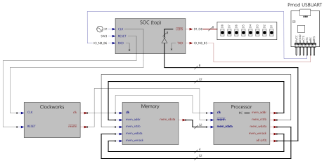

## Step16 - Gatemate RISC-V Tutorial

### Description

This folder is step16 of the popular FPGA tutorial ["From Blinker to RISCV"](https://github.com/BrunoLevy/learn-fpga/tree/master/FemtoRV/TUTORIALS/FROM_BLINKER_TO_RISCV) by BrunoLevy.

Step16 implements three STORE instructions:

| Instruction | Type | Functional Effect |
| :--- | :---: | :--- |
| `SW rs2, imm(rs1)` | Word (32b) | `M[rs1 + imm] = rs2[31:0]` |
| `SH rs2, imm(rs1)` | Half (16b) | `M[rs1 + imm] = rs2[15:0]` |
| `SB rs2, imm(rs1)` | Byte (8b)  | `M[rs1 + imm] = rs2[7:0]`  |

This step also updates the processor state machine to add the STORE instruction group, and adds the memory-write signals mem_wdata and mem_wmask to the processor (ouput) and memory (input) interface. Below is the updated Verilog logic diagram:



The updated processor instruction code gets tested with a new RISC-V assembly application, using the just implemented STORE function SB. The assembly program below initializes four words at address 400, then copies them do address 800 using SB store, and finally reads the values from address 800 into register a0 (x10). This register is connected to the LEDs, and the delay loop (wait function) slows it down to show the values at human speed.

```verilog
   integer L0_   = 12;
   integer L1_   = 40;
   integer wait_ = 64;
   integer L2_   = 72;

   initial begin

      LI(a0,0);
   // Copy 16 bytes from adress 400
   // to address 800
      LI(s1,16);
      LI(s0,0);
   Label(L0_);
      LB(a1,s0,400);
      SB(a1,s0,800);
      CALL(LabelRef(wait_));
      ADDI(s0,s0,1);
      BNE(s0,s1, LabelRef(L0_));

   // Read 16 bytes from adress 800
      LI(s0,0);
   Label(L1_);
      LB(a0,s0,800); // a0 (=x10) is plugged to the LEDs
      CALL(LabelRef(wait_));
      ADDI(s0,s0,1);
      BNE(s0,s1, LabelRef(L1_));
      EBREAK();

   Label(wait_);
      LI(t0,1);
      SLLI(t0,t0,slow_bit);
   Label(L2_);
      ADDI(t0,t0,-1);
      BNEZ(t0,LabelRef(L2_));
      RET();

      endASM();

      // Note: index 100 (word address)
      //     corresponds to
      // address 400 (byte address)
      MEM[100] = {8'h4, 8'h3, 8'h2, 8'h1};
      MEM[101] = {8'h8, 8'h7, 8'h6, 8'h5};
      MEM[102] = {8'hc, 8'hb, 8'ha, 8'h9};
      MEM[103] = {8'hff, 8'hf, 8'he, 8'hd};
   end
```

### Build FPGA Bitstream

```
$ make
/home/fm/oss-cad-suite/bin/yosys -ql log/synth.log -p 'read -sv SOC.v ../rtl-shared/clockworks.v ../rtl-shared/pll_gatemate.v; synth_gatemate -top SOC -luttree -nomx8 -vlog net/SOC_synth.v; write_json net/SOC_synth.json'
test -e ../gatemate-e1.ccf || exit
/home/fm/oss-cad-suite/bin/nextpnr-himbaechel --device=CCGM1A1 --json net/SOC_synth.json --write net/SOC_impl.v -o out=net/SOC_impl.txt -o ccf=../gatemate-e1.ccf --router router2 > log/impl.log
Info: Using uarch 'gatemate' for device 'CCGM1A1'
Info: Using timing mode 'WORST'
Info: Using operation mode 'SPEED'
...
Info: Device utilisation:
Info: 	            USR_RSTN:       0/      1     0%
Info: 	            CPE_COMP:       0/  20480     0%
Info: 	         CPE_CPLINES:       6/  20480     0%
Info: 	               IOSEL:      12/    162     7%
Info: 	                GPIO:      12/    162     7%
Info: 	               CLKIN:       1/      1   100%
Info: 	              GLBOUT:       1/      1   100%
Info: 	                 PLL:       0/      4     0%
Info: 	            CFG_CTRL:       0/      1     0%
Info: 	              SERDES:       0/      1     0%
Info: 	              CPE_LT:    1707/  40960     4%
Info: 	              CPE_FF:      91/  40960     0%
Info: 	           CPE_RAMIO:     302/  40960     0%
Info: 	            RAM_HALF:       3/     64     4%
...
Info: Program finished normally.
/home/fm/oss-cad-suite/bin/gmpack --input net/SOC_impl.txt --bit SOC.bit
```
### Simulation
```
$ make test
Running testbench simulation
test ! -e SOC.tb || rm SOC.tb
test ! -e SOC.vcd || rm SOC.vcd
/home/fm/oss-cad-suite/bin/iverilog -DBENCH -o SOC.tb -s SOC_tb SOC_tb.v SOC.v ../rtl-shared/clockworks.v ../rtl-shared/pll_gatemate.v
/home/fm/oss-cad-suite/bin/vvp SOC.tb
Label:         12
Label:         40
Label:         64
Label:         72
LEDS = 11111111
LEDS = 11111110
LEDS = 11111101
LEDS = 11111100
LEDS = 11111011
LEDS = 11111010
LEDS = 11111001
LEDS = 11111000
LEDS = 11110111
LEDS = 11110110
LEDS = 11110101
LEDS = 11110100
LEDS = 11110011
LEDS = 11110010
LEDS = 11110001
LEDS = 11110000
LEDS = 00000000
SOC.v:348: $finish called at 2230597 (1s)
```

### Board Programming
```
$ make prog
Programming E1 SPI Config:
/home/fm/oss-cad-suite/bin/openFPGALoader  -b gatemate_evb_spi SOC.bit
empty
Jtag frequency : requested 6.00MHz    -> real 6.00MHz   
JEDEC ID: 0xc22817
Detected: Macronix MX25R6435F 128 sectors size: 64Mb
00000000 00000000 00000000 00
start addr: 00000000, end_addr: 00020000
Erasing: [==================================================] 100.00%
Done
Writing: [==================================================] 100.00%
Done
Wait for CFG_DONE DONE
```
