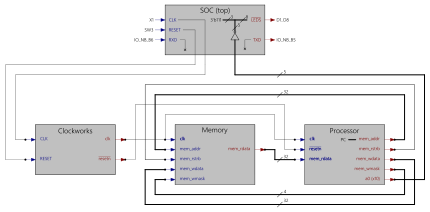

## Step16 - Gatemate RISC-V Tutorial

### Description

This folder is step16 of the popular FPGA tutorial ["From Blinker to RISCV"](https://github.com/BrunoLevy/learn-fpga/tree/master/FemtoRV/TUTORIALS/FROM_BLINKER_TO_RISCV) by BrunoLevy.

Step16 implements three STORE instructions:

 | Instruction     | Effect                                  |
 |-----------------|-----------------------------------------|
 | SW(rs2,rs1,imm) | store rs2 at address rs1+imm            |
 | SB(rs2,rs1,imm) | store 8 LSBs of rs2 at address rs1+imm  |
 | SH(rs2,rs1,imm) | store 16 LSBs of rs2 at address rs1+imm |

This step also updates the processor state machine to add the STORE instruction group, and adds the memory-write signals mem_wdata and mem_wmask to the processor (ouput) and memory (input) interface. Below is the updated Verilog logic diagram:



The updated processor instruction code gets tested with a new RISC-V assembly application, using the just implemented STORE function SB. The assembly program below initializes four words at address 400, then copies them do address 800 using SB store, and finally reads the values from address 800 into register a0 (x10). This register is connected to the LEDs, and the delay loop (wait function) slows it down to show the values at human speed.

```verilog
   integer L0_   = 12;
   integer L1_   = 40;
   integer wait_ = 64;
   integer L2_   = 72;

   initial begin

      LI(a0,0);
   // Copy 16 bytes from adress 400
   // to address 800
      LI(s1,16);
      LI(s0,0);
   Label(L0_);
      LB(a1,s0,400);
      SB(a1,s0,800);
      CALL(LabelRef(wait_));
      ADDI(s0,s0,1);
      BNE(s0,s1, LabelRef(L0_));

   // Read 16 bytes from adress 800
      LI(s0,0);
   Label(L1_);
      LB(a0,s0,800); // a0 (=x10) is plugged to the LEDs
      CALL(LabelRef(wait_));
      ADDI(s0,s0,1);
      BNE(s0,s1, LabelRef(L1_));
      EBREAK();

   Label(wait_);
      LI(t0,1);
      SLLI(t0,t0,slow_bit);
   Label(L2_);
      ADDI(t0,t0,-1);
      BNEZ(t0,LabelRef(L2_));
      RET();

      endASM();

      // Note: index 100 (word address)
      //     corresponds to
      // address 400 (byte address)
      MEM[100] = {8'h4, 8'h3, 8'h2, 8'h1};
      MEM[101] = {8'h8, 8'h7, 8'h6, 8'h5};
      MEM[102] = {8'hc, 8'hb, 8'ha, 8'h9};
      MEM[103] = {8'hff, 8'hf, 8'he, 8'hd};
   end
```

### Build FPGA Bitstream

```
step16$ make
/home/fm/cc-toolchain-linux/bin/yosys/yosys -p 'read -sv SOC.v ../rtl-shared/clockworks.v ../rtl-shared/pll_gatemate.v; synth_gatemate -top SOC -vlog SOC_synth.v'
 /----------------------------------------------------------------------------\
 |                                                                            |
 |  yosys -- Yosys Open SYnthesis Suite                                       |
 |                                                                            |
 |  Copyright (C) 2012 - 2020  Claire Xenia Wolf <claire@yosyshq.com>         |
...
=== SOC ===

   Number of wires:                515
   Number of wire bits:           3915
   Number of public wires:          89
   Number of public wire bits:    2107
   Number of memories:               0
   Number of memory bits:            0
   Number of processes:              0
   Number of cells:               1062
     CC_ADDF                       152
     CC_BRAM_20K                     3
     CC_BUFG                         1
     CC_DFF                         88
     CC_IBUF                         3
     CC_LUT1                        37
     CC_LUT2                        26
     CC_LUT3                       330
     CC_LUT4                       413
     CC_OBUF                         9
...
End of script. Logfile hash: 5daa1a1d8a, CPU: user 1.36s system 0.13s, MEM: 28.51 MB peak
Yosys 0.29+42 (git sha1 2004a9ff4, g++ 12.2.1 -Os)
Time spent: 33% 1x abc (0 sec), 14% 27x opt_expr (0 sec), ...
test -e ../gatemate-e1.ccf || exit
/home/fm/cc-toolchain-linux/bin/p_r/p_r -i SOC_synth.v -o SOC -ccf ../gatemate-e1.ccf +uCIO > SOC_pr.log
```
### Simulation
```
step16$ make test
Running testbench simulation
test ! -e SOC.tb || rm SOC.tb
test ! -e SOC.vcd || rm SOC.vcd
/usr/bin/iverilog -DBENCH -o SOC.tb -s SOC_tb SOC_tb.v SOC.v ../rtl-shared/clockworks.v ../rtl-shared/pll_gatemate.v
/usr/bin/vvp SOC.tb
Label:         12
Label:         40
Label:         64
Label:         72
LEDS = 11111111
LEDS = 11111110
LEDS = 11111101
LEDS = 11111100
LEDS = 11111011
LEDS = 11111010
LEDS = 11111001
LEDS = 11111000
LEDS = 11110111
LEDS = 11110110
LEDS = 11110101
LEDS = 11110100
LEDS = 11110011
LEDS = 11110010
LEDS = 11110001
LEDS = 11110000
LEDS = 11100000
```

### Board Programming
```
step16$ make prog
Programming E1 SPI Config:
/home/fm/cc-toolchain-linux/bin/openFPGALoader/openFPGALoader -b gatemate_evb_spi SOC_00.cfg
Jtag frequency : requested 6.00MHz   -> real 6.00MHz
Detail:
Jedec ID          : c2
memory type       : 28
memory capacity   : 17
EDID + CFD length : c2
EDID              : 1728
CFD               :
00
Detail:
Jedec ID          : c2
memory type       : 28
memory capacity   : 17
EDID + CFD length : c2
EDID              : 1728
CFD               :
flash chip unknown: use basic protection detection
Erasing: [==================================================] 100.00%
Done
Writing: [==================================================] 100.00%
Done
Wait for CFG_DONE DONE
```