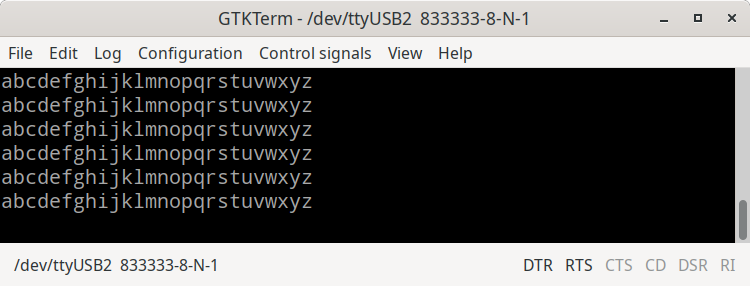
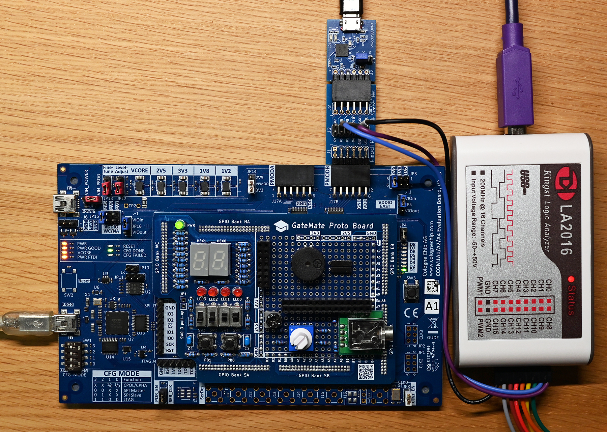
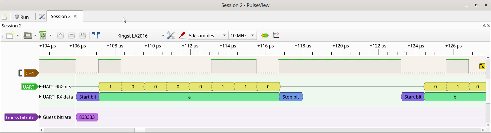
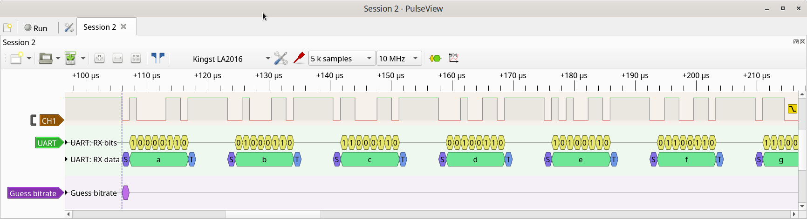

## Step17 - Gatemate RISC-V Tutorial

### Description

This folder is step17 of the popular FPGA tutorial ["From Blinker to RISCV"](https://github.com/BrunoLevy/learn-fpga/tree/master/FemtoRV/TUTORIALS/FROM_BLINKER_TO_RISCV) by BrunoLevy.

Step17 implements memory-mapped IO for controlling devices, and adds the UART serial device with a target baudrate of 1M. The assembly program gets the new "putc" function that repeatedly sends a set of alphabet characters "abcdefghijklmnopqrstuvwxyz" to the UART.

Module design:


The assembly program:
```verilog
  initial begin
      LI(sp,32'h1800);   // End of RAM, 6kB
      LI(gp,32'h400000); // IO page

   Label(L0_);

      // Count from 0 to 15 on the LEDs
      LI(s0,16); // upper bound of loop
      LI(a0,0);
   Label(L1_);
      SW(a0,gp,IO_BIT_TO_OFFSET(IO_LEDS_bit));
      CALL(LabelRef(wait_));
      ADDI(a0,a0,1);
      BNE(a0,s0,LabelRef(L1_));

      // Send abcdef...xyz to the UART
      LI(s0,26); // upper bound of loop
      LI(a0,"a");
      LI(s1,0);
   Label(L2_);
      CALL(LabelRef(putc_));
      ADDI(a0,a0,1);
      ADDI(s1,s1,1);
      BNE(s1,s0,LabelRef(L2_));

      // CR;LF
      LI(a0,13); // ASCII code CR
      CALL(LabelRef(putc_));
      LI(a0,10); // ASCII code LF
      CALL(LabelRef(putc_));

      J(LabelRef(L0_));

      EBREAK(); // I systematically keep it before functions
                // in case I decide to remove the loop...

   Label(wait_);
      LI(t0,1);
      SLLI(t0,t0,slow_bit);
   Label(wait_L0_);
      ADDI(t0,t0,-1);
      BNEZ(t0,LabelRef(wait_L0_));
      RET();

   Label(putc_);
      // Send character to UART
      SW(a0,gp,IO_BIT_TO_OFFSET(IO_UART_DAT_bit));
      // Read UART status, and loop until bit 9 (busy sending)
      // is zero.
      LI(t0,1<<9);
   Label(putc_L0_);
      LW(t1,gp,IO_BIT_TO_OFFSET(IO_UART_CNTL_bit));
      AND(t1,t1,t0);
      BNEZ(t1,LabelRef(putc_L0_));
      RET();

      endASM();
   end
```

### Build FPGA Bitstream

```
$ make
/home/fm/oss-cad-suite/bin/yosys -ql log/synth.log -p 'read -sv SOC.v ../rtl-shared/clockworks.v ../rtl-shared/pll_gatemate.v ../rtl-shared/emmitter_uart.v; synth_gatemate -top SOC -luttree -nomx8 -vlog net/SOC_synth.v; write_json net/SOC_synth.json'
test -e ../gatemate-e1.ccf || exit
/home/fm/oss-cad-suite/bin/nextpnr-himbaechel --device=CCGM1A1 --json net/SOC_synth.json --write net/SOC_impl.v -o out=net/SOC_impl.txt -o ccf=../gatemate-e1.ccf --router router2 > log/impl.log
Info: Using uarch 'gatemate' for device 'CCGM1A1'
Info: Using timing mode 'WORST'
Info: Using operation mode 'SPEED'
...
Info: Device utilisation:
Info: 	            USR_RSTN:       0/      1     0%
Info: 	            CPE_COMP:       0/  20480     0%
Info: 	         CPE_CPLINES:       7/  20480     0%
Info: 	               IOSEL:      12/    162     7%
Info: 	                GPIO:      12/    162     7%
Info: 	               CLKIN:       1/      1   100%
Info: 	              GLBOUT:       1/      1   100%
Info: 	                 PLL:       1/      4    25%
Info: 	            CFG_CTRL:       0/      1     0%
Info: 	              SERDES:       0/      1     0%
Info: 	              CPE_LT:    2067/  40960     5%
Info: 	              CPE_FF:     106/  40960     0%
Info: 	           CPE_RAMIO:     496/  40960     1%
Info: 	            RAM_HALF:       5/     64     7%
...
Info: Program finished normally.
/home/fm/oss-cad-suite/bin/gmpack --input net/SOC_impl.txt --bit SOC.bit
```
### Simulation
```
$ make test
Running testbench simulation
test ! -e SOC.tb || rm SOC.tb
test ! -e SOC.vcd || rm SOC.vcd
/home/fm/oss-cad-suite/bin/iverilog -DBENCH -o SOC.tb -s SOC_tb SOC_tb.v SOC.v ../rtl-shared/clockworks.v ../rtl-shared/pll_gatemate.v ../rtl-shared/emmitter_uart.v
/home/fm/oss-cad-suite/bin/vvp SOC.tb
Label:         12
Label:         20
Label:         52
Label:        104
Label:        112
Label:        124
Label:        132
LEDS = 111xxxxx
LEDS = 11111110
LEDS = 11111101
LEDS = 11111100
LEDS = 11111011
LEDS = 11111010
LEDS = 11111001
LEDS = 11111000
LEDS = 11110111
LEDS = 11110110
LEDS = 11110101
LEDS = 11110100
LEDS = 11110011
LEDS = 11110010
LEDS = 11110001
LEDS = 11110000
abcdefghijklmnopqrstuvwxyz
SOC.v:479: $finish called at 2378738 (1s)
```

### Board Programming
```
$ make prog
Programming E1 SPI Config:
/home/fm/oss-cad-suite/bin/openFPGALoader  -b gatemate_evb_spi SOC.bit
empty
Jtag frequency : requested 6.00MHz    -> real 6.00MHz   
JEDEC ID: 0xc22817
Detected: Macronix MX25R6435F 128 sectors size: 64Mb
00000000 00000000 00000000 00
start addr: 00000000, end_addr: 00020000
Erasing: [==================================================] 100.00%
Done
Writing: [==================================================] 100.00%
Done
```
### Output
We can assign the UART to the E1 boards PMODB connector pins, and plug in the Digilent PMOD-UART converter to see the RSIC-V program output in a terminal window:



The original code had a bug that set the baud rate to 833.333, falling short of the UART target speed of 1Mbaud (1.000.000). 
This issue as been resolved in [Issue #3](https://github.com/fm4dd/gatemate-riscv/issues/3).


Logic Analyzer UART protocol bitrate speedcheck:

The UART-transmitted ASCII data capture at 833.333 baud:


The serial port works at the intended baud rate:
```
$ ./terminal.sh 
picocom v3.1

port is        : /dev/ttyUSB2
flowcontrol    : none
baudrate is    : 1000000
parity is      : none
databits are   : 8
stopbits are   : 1
escape is      : C-a
local echo is  : no
noinit is      : no
noreset is     : no
hangup is      : no
nolock is      : no
send_cmd is    : ascii-xfr -s -l 30 -n
receive_cmd is : rz -vv -E
imap is        : crcrlf,lfcrlf,
omap is        : crlf,delbs,
emap is        : crcrlf,delbs,
logfile is     : none
initstring     : none
exit_after is  : not set
exit is        : no

Type [C-a] [C-h] to see available commands
Terminal ready
abcdefghijklmnopqrstuvwxyz

abcdefghijklmnopqrstuvwxyz

abcdefghijklmnopqrstuvwxyz

abcdefghijklmnopqrstuvwxyz

Terminating...
Picocom was killed
Terminated
```
