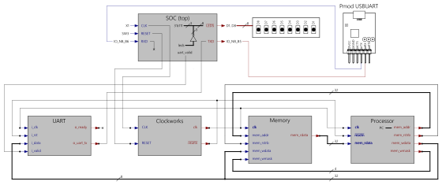

## Step17 - Gatemate RISC-V Tutorial

### Description

This folder is step17 of the popular FPGA tutorial ["From Blinker to RISCV"](https://github.com/BrunoLevy/learn-fpga/tree/master/FemtoRV/TUTORIALS/FROM_BLINKER_TO_RISCV) by BrunoLevy.

Step17 implements memory-mapped IO for controlling devices, and adds the UART serial device with a target baudrate of 1M. The assembly program gets the new "putc" function that repeatedly sends a set of alphabet characters "abcdefghijklmnopqrstuvwxyz" to the UART.

Module design:


The assembly program:
```verilog
  initial begin
      LI(sp,32'h1800);   // End of RAM, 6kB
      LI(gp,32'h400000); // IO page

   Label(L0_);

      // Count from 0 to 15 on the LEDs
      LI(s0,16); // upper bound of loop
      LI(a0,0);
   Label(L1_);
      SW(a0,gp,IO_BIT_TO_OFFSET(IO_LEDS_bit));
      CALL(LabelRef(wait_));
      ADDI(a0,a0,1);
      BNE(a0,s0,LabelRef(L1_));

      // Send abcdef...xyz to the UART
      LI(s0,26); // upper bound of loop
      LI(a0,"a");
      LI(s1,0);
   Label(L2_);
      CALL(LabelRef(putc_));
      ADDI(a0,a0,1);
      ADDI(s1,s1,1);
      BNE(s1,s0,LabelRef(L2_));

      // CR;LF
      LI(a0,13); // ASCII code CR
      CALL(LabelRef(putc_));
      LI(a0,10); // ASCII code LF
      CALL(LabelRef(putc_));

      J(LabelRef(L0_));

      EBREAK(); // I systematically keep it before functions
                // in case I decide to remove the loop...

   Label(wait_);
      LI(t0,1);
      SLLI(t0,t0,slow_bit);
   Label(wait_L0_);
      ADDI(t0,t0,-1);
      BNEZ(t0,LabelRef(wait_L0_));
      RET();

   Label(putc_);
      // Send character to UART
      SW(a0,gp,IO_BIT_TO_OFFSET(IO_UART_DAT_bit));
      // Read UART status, and loop until bit 9 (busy sending)
      // is zero.
      LI(t0,1<<9);
   Label(putc_L0_);
      LW(t1,gp,IO_BIT_TO_OFFSET(IO_UART_CNTL_bit));
      AND(t1,t1,t0);
      BNEZ(t1,LabelRef(putc_L0_));
      RET();

      endASM();
   end
```

### Build FPGA Bitstream

```
step17$ make
/home/fm/cc-toolchain-linux/bin/yosys/yosys -p 'read -sv SOC.v ../rtl-shared/clockworks.v ../rtl-shared/pll_gatemate.v; synth_gatemate -top SOC -vlog SOC_synth.v'
 /----------------------------------------------------------------------------\
 |                                                                            |
 |  yosys -- Yosys Open SYnthesis Suite                                       |
 |                                                                            |
 |  Copyright (C) 2012 - 2020  Claire Xenia Wolf <claire@yosyshq.com>         |
...
=== SOC ===

   Number of wires:                647
   Number of wire bits:           5061
   Number of public wires:         125
   Number of public wire bits:    2897
   Number of memories:               0
   Number of memory bits:            0
   Number of processes:              0
   Number of cells:               1207
     CC_ADDF                       170
     CC_BRAM_20K                     5
     CC_BUFG                         1
     CC_DFF                        106
     CC_IBUF                         3
     CC_LUT1                        37
     CC_LUT2                        41
     CC_LUT3                       395
     CC_LUT4                       439
     CC_OBUF                         9
     CC_PLL                          1
...
End of script. Logfile hash: 7ca6242773, CPU: user 1.03s system 0.72s, MEM: 30.86 MB peak
Yosys 0.29+42 (git sha1 2004a9ff4, g++ 12.2.1 -Os)
Time spent: 30% 1x abc (0 sec), 14% 28x opt_expr (0 sec), ...
test -e ../gatemate-e1.ccf || exit
/home/fm/cc-toolchain-linux/bin/p_r/p_r -i SOC_synth.v -o SOC -ccf ../gatemate-e1.ccf +uCIO > SOC_pr.log
```
### Simulation
```
step17$ make test
Running testbench simulation
test ! -e SOC.tb || rm SOC.tb
test ! -e SOC.vcd || rm SOC.vcd
/usr/bin/iverilog -DBENCH -o SOC.tb -s SOC_tb SOC_tb.v SOC.v ../rtl-shared/clockworks.v ../rtl-shared/pll_gatemate.v ../rtl-shared/emmitter_uart.v
/usr/bin/vvp SOC.tb
Label:         12
Label:         20
Label:         52
Label:        104
Label:        112
Label:        124
Label:        132
LEDS = 111xxxxx
LEDS = 11111110
LEDS = 11111101
LEDS = 11111100
LEDS = 11111011
LEDS = 11111010
LEDS = 11111001
LEDS = 11111000
LEDS = 11110111
LEDS = 11110110
LEDS = 11110101
LEDS = 11110100
LEDS = 11110011
LEDS = 11110010
LEDS = 11110001
LEDS = 11110000
abcdefghijklmnopqrstuvwxyz
```

### Board Programming
```
step17$ make prog
Programming E1 SPI Config:
/home/fm/cc-toolchain-linux/bin/openFPGALoader/openFPGALoader -b gatemate_evb_spi SOC_00.cfg
Jtag frequency : requested 6.00MHz   -> real 6.00MHz
Detail:
Jedec ID          : c2
memory type       : 28
memory capacity   : 17
EDID + CFD length : c2
EDID              : 1728
CFD               :
00
Detail:
Jedec ID          : c2
memory type       : 28
memory capacity   : 17
EDID + CFD length : c2
EDID              : 1728
CFD               :
flash chip unknown: use basic protection detection
Erasing: [==================================================] 100.00%
Done
Writing: [==================================================] 100.00%
Done
Wait for CFG_DONE DONE
```
### Output
We can assign the UART to the E1 boards PMODB connector pins, and plug in the Digilent PMOD-UART converter to see the RSIC-V program output in a terminal window:


The terminal screenshot shows a baudrate of 833.333, falling short of the UART target speed of 1Mbaud (1.000.000). The root cause is not fully clear for Gatemate, and [Issue #3](https://github.com/fm4dd/gatemate-riscv/issues/3) open for detail discussion.


Logic Analyzer UART protocol bitrate speedcheck:

The UART-transmitted ASCII data capture at 833.333 baud:

