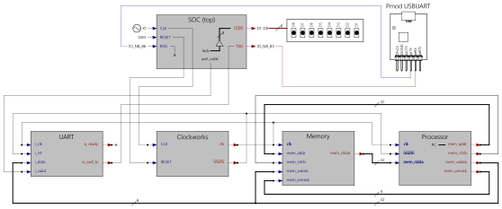
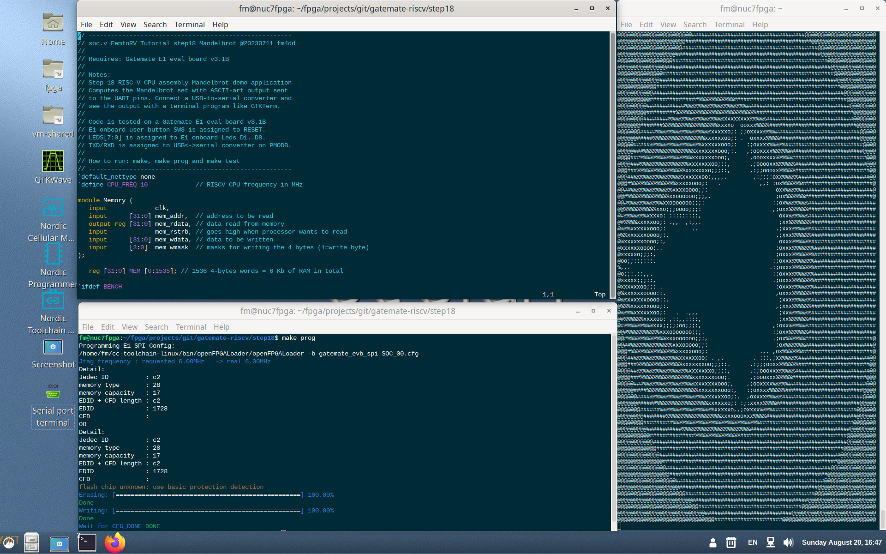

## Step18 - Gatemate RISC-V Tutorial

### Description

This folder is step18 of the popular FPGA tutorial ["From Blinker to RISCV"](https://github.com/BrunoLevy/learn-fpga/tree/master/FemtoRV/TUTORIALS/FROM_BLINKER_TO_RISCV) by BrunoLevy.

Step18 implements a RISC-V assembly program that computes a crude, ASCII-art version of the Mandelbrot set that is send to the UART and displayed in a terminal window. Module design is the same as step17:


### Build FPGA Bitstream

```
$ make
/home/fm/oss-cad-suite/bin/yosys -ql log/synth.log -p 'read -sv SOC.v ../rtl-shared/clockworks.v ../rtl-shared/pll_gatemate.v ../rtl-shared/emmitter_uart.v; synth_gatemate -top SOC -luttree -nomx8 -vlog net/SOC_synth.v; write_json net/SOC_synth.json'
test -e ../gatemate-e1.ccf || exit
/home/fm/oss-cad-suite/bin/nextpnr-himbaechel --device=CCGM1A1 --json net/SOC_synth.json --write net/SOC_impl.v -o out=net/SOC_impl.txt -o ccf=../gatemate-e1.ccf --router router2 > log/impl.log
Info: Using uarch 'gatemate' for device 'CCGM1A1'
Info: Using timing mode 'WORST'
Info: Using operation mode 'SPEED'
...
Info: Device utilisation:
Info: 	            USR_RSTN:       0/      1     0%
Info: 	            CPE_COMP:       0/  20480     0%
Info: 	         CPE_CPLINES:       7/  20480     0%
Info: 	               IOSEL:      12/    162     7%
Info: 	                GPIO:      12/    162     7%
Info: 	               CLKIN:       1/      1   100%
Info: 	              GLBOUT:       1/      1   100%
Info: 	                 PLL:       1/      4    25%
Info: 	            CFG_CTRL:       0/      1     0%
Info: 	              SERDES:       0/      1     0%
Info: 	              CPE_LT:    2067/  40960     5%
Info: 	              CPE_FF:     106/  40960     0%
Info: 	           CPE_RAMIO:     496/  40960     1%
Info: 	            RAM_HALF:       5/     64     7%
...
Info: Program finished normally.
/home/fm/oss-cad-suite/bin/gmpack --input net/SOC_impl.txt --bit SOC.bit
```
### Simulation
```
step18$ make test
Running testbench simulation
test ! -e SOC.tb || rm SOC.tb
test ! -e SOC.vcd || rm SOC.vcd
/usr/bin/iverilog -DBENCH -o SOC.tb -s SOC_tb SOC_tb.v SOC.v ../rtl-shared/clockworks.v ../rtl-shared/pll_gatemate.v ../rtl-shared/emmitter_uart.v
/usr/bin/vvp SOC.tb
Label:         12
Label:         16
Label:         76
Label:         84
Label:         96
Label:        188
Label:        264
Label:        272
Label:        284
Label:        292
Label:        308
Label:        316
Label:        328
Label:        344
LEDS = 111xxxxx
LEDS = 11110101
LEDS = 11111010
LEDS = 11110101
LEDS = 11111010
LEDS = 11110101
LEDS = 11111010
LEDS = 11110101
LEDS = 11111010
LEDS = 11110101
LEDS = 11111111
@@@@@@@@@@@@@@@@@@@@@@@@@@@@@@@@@@@@@@@@#@@@@@@@@@@@@@@@@@@@@@@@@@@@@@@@@@@@@@@@ 
@@@@@@@@@@@@@@@@@@@@@@@@@@@@@@@@##################@@@@@@@@@@@@@@@@@@@@@@@@@@@@@@ 
@@@@@@@@@@@@@@@@@@@@@@@@@@@@#########################@@@@@@@@@@@@@@@@@@@@@@@@@@@ 
@@@@@@@@@@@@@@@@@@@@@@@@@###############################@@@@@@@@@@@@@@@@@@@@@@@@ 
@@@@@@@@@@@@@@@@@@@@@@@###################################@@@@@@@@@@@@@@@@@@@@@@ 
@@@@@@@@@@@@@@@@@@@@@#######################################@@@@@@@@@@@@@@@@@@@@ 
@@@@@@@@@@@@@@@@@@@@##########################################@@@@@@@@@@@@@@@@@@ 
@@@@@@@@@@@@@@@@@@#############################################@@@@@@@@@@@@@@@@@ 
@@@@@@@@@@@@@@@@@################################################@@@@@@@@@@@@@@@ 
@@@@@@@@@@@@@@@###################################################@@@@@@@@@@@@@@ 
@@@@@@@@@@@@@@#####################################################@@@@@@@@@@@@@ 
@@@@@@@@@@@@@#######################################################@@@@@@@@@@@@ 
@@@@@@@@@@@@#########################################################@@@@@@@@@@@ 
@@@@@@@@@@@###########################################################@@@@@@@@@@ 
@@@@@@@@@@###############%%%%%%%%%%%###################################@@@@@@@@@ 
@@@@@@@@@############%%%%%%%%%%%%%%%%%%%################################@@@@@@@@ 
@@@@@@@@@#########%%%%%%%%%%%%%%%%%%%%%%%%%##############################@@@@@@@ 
@@@@@@@@########%%%%%%%%%%%%%%%%%xxxxxxxx%%%%%###########################@@@@@@@ 
@@@@@@@#######%%%%%%%%%%%%%%%%%xxxxo  ooxxx%%%%###########################@@@@@@ 
@@@@@@@#####%%%%%%%%%%%%%%%%%xxxxxo;: ;;oxxxx%%%%##########################@@@@@ 
@@@@@@#####%%%%%%%%%%%%%%%%xxxxxxoo;: .  oxxxx%%%%#########################@@@@@ 
@@^C** VVP Stop(0) **
** Flushing output streams.
** Current simulation time is 27146677 ticks.
> finish
** Continue **
```

### Board Programming
```
$ make prog
Programming E1 SPI Config:
/home/fm/oss-cad-suite/bin/openFPGALoader  -b gatemate_evb_spi SOC.bit
empty
Jtag frequency : requested 6.00MHz    -> real 6.00MHz   
JEDEC ID: 0xc22817
Detected: Macronix MX25R6435F 128 sectors size: 64Mb
00000000 00000000 00000000 00
start addr: 00000000, end_addr: 00020000
Erasing: [==================================================] 100.00%
Done
Writing: [==================================================] 100.00%
Done
Wait for CFG_DONE DONE
```
### Output
With the UART assigned to the E1 boards PMODB connector pins, the Digilent PMOD-UART converter to see the RISC-V program output, and we can display it in a terminal window:



The original code had a bug that set the baud rate to 833.333, falling short of the UART target speed of 1Mbaud (1.000.000).
This issue as been resolved in [Issue #3](https://github.com/fm4dd/gatemate-riscv/issues/3).

The serial port works at the intended baud rate:
```
$ ./terminal.sh 
picocom v3.1

port is        : /dev/ttyUSB2
flowcontrol    : none
baudrate is    : 1000000
parity is      : none
databits are   : 8
stopbits are   : 1
escape is      : C-a
local echo is  : no
noinit is      : no
noreset is     : no
hangup is      : no
nolock is      : no
send_cmd is    : ascii-xfr -s -l 30 -n
receive_cmd is : rz -vv -E
imap is        : crcrlf,lfcrlf,
omap is        : crlf,delbs,
emap is        : crcrlf,delbs,
logfile is     : none
initstring     : none
exit_after is  : not set
exit is        : no

Type [C-a] [C-h] to see available commands
Terminal ready
@@@@@@@@@@@@@@@@@@@@@@@@@@@@@@@@@@@@@@@@#@@@@@@@@@@@@@@@@@@@@@@@@@@@@@@@@@@@@@@@ 
@@@@@@@@@@@@@@@@@@@@@@@@@@@@@@@@##################@@@@@@@@@@@@@@@@@@@@@@@@@@@@@@ 
@@@@@@@@@@@@@@@@@@@@@@@@@@@@#########################@@@@@@@@@@@@@@@@@@@@@@@@@@@ 
@@@@@@@@@@@@@@@@@@@@@@@@@###############################@@@@@@@@@@@@@@@@@@@@@@@@ 
@@@@@@@@@@@@@@@@@@@@@@@###################################@@@@@@@@@@@@@@@@@@@@@@ 
@@@@@@@@@@@@@@@@@@@@@#######################################@@@@@@@@@@@@@@@@@@@@ 
@@@@@@@@@@@@@@@@@@@@##########################################@@@@@@@@@@@@@@@@@@ 
@@@@@@@@@@@@@@@@@@#############################################@@@@@@@@@@@@@@@@@ 
@@@@@@@@@@@@@@@@@################################################@@@@@@@@@@@@@@@ 
@@@@@@@@@@@@@@@###################################################@@@@@@@@@@@@@@ 
@@@@@@@@@@@@@@#####################################################@@@@@@@@@@@@@ 
@@@@@@@@@@@@@#######################################################@@@@@@@@@@@@ 
@@@@@@@@@@@@#########################################################@@@@@@@@@@@ 
@@@@@@@@@@@###########################################################@@@@@@@@@@ 
@@@@@@@@@@###############%%%%%%%%%%%###################################@@@@@@@@@ 
@@@@@@@@@############%%%%%%%%%%%%%%%%%%%################################@@@@@@@@ 
@@@@@@@@@#########%%%%%%%%%%%%%%%%%%%%%%%%%##############################@@@@@@@ 
@@@@@@@@########%%%%%%%%%%%%%%%%%xxxxxxxx%%%%%###########################@@@@@@@ 
@@@@@@@#######%%%%%%%%%%%%%%%%%xxxxo  ooxxx%%%%###########################@@@@@@ 
@@@@@@@#####%%%%%%%%%%%%%%%%%xxxxxo;: ;;oxxxx%%%%##########################@@@@@ 
@@@@@@#####%%%%%%%%%%%%%%%%xxxxxxoo;: .  oxxxx%%%%#########################@@@@@ 
@@@@@#####%%%%%%%%%%%%%%%%xxxxxxooo;:   :;oxxxx%%%%%########################@@@@ 
@@@@@###%%%%%%%%%%%%%%%%xxxxxxxooo;:.   ,;ooxxxx%%%%%#######################@@@@ 
@@@@###%%%%%%%%%%%%%%%%xxxxxxxooo;,      ,oooxxxx%%%%%#######################@@@ 
@@@@###%%%%%%%%%%%%%%%xxxxxxxoo;;:,      .;ooooxx%%%%%%######################@@@ 
@@@###%%%%%%%%%%%%%%%xxxxxxxo;;;::,      ,:;;oooxx%%%%%#######################@@ 
@@@##%%%%%%%%%%%%%%%xxxxxxoo:,,,,.        ,:;;;:oxx%%%%%######################@@ 
@@@#%%%%%%%%%%%%%%xxxxxooo;:   .            ,,: :ox%%%%%%######################@ 
@@##%%%%%%%%%%%%%xxxxoooo;;:                     oxx%%%%%######################@ 
@@#%%%%%%%%%%%%%xxoooooo;;;,.                    ;ox%%%%%%#####################@ 
@@#%%%%%%%%%%%xxooooooo;;;:                     :;ox%%%%%%%##################### 
@@%%%%%%%%%%xxo;;;oooo;;;:                      ,;oxx%%%%%%##################### 
@#%%%%%%%xxxxo: :::::::::,                        oxx%%%%%%##################### 
@#%%%%xxxxxoo;: .,,  ,:,,.                        ;xx%%%%%%%#################### 
@%%%xxxxxxooo;:        ..                        .;xxx%%%%%%#################### 
@%%xxxxxxoooo;:.                                 .;xxx%%%%%%#################### 
@%xxxxxxoooo;:,                                   oxxx%%%%%%#################### 
@xxxxxxoooo;..                                   :oxxx%%%%%%%################### 
@xxxxxo;;;:,                                     ;oxxx%%%%%%%################### 
@oo;;::;:::.                                    :;oxxx%%%%%%%################### 
%,,.                                           .:;oxxx%%%%%%%################### 
@o;;:.::,,.                                     :;oxxx%%%%%%%################### 
@xxxxx;;;::,                                    .;oxxx%%%%%%%################### 
@xxxxxxoo;;: .                                   :oxxx%%%%%%%################### 
@%xxxxxxoooo::.                                  ,oxxx%%%%%%#################### 
@%%xxxxxxoooo::.                                  ;xxx%%%%%%#################### 
@%%%xxxxxxooo;:.                                 ,;xxx%%%%%%#################### 
@%%%%xxxxxxoo;:   .  .,,,                         ;xx%%%%%%%#################### 
@#%%%%%%xxxxoo: ,::,,::::,                        ;xx%%%%%%##################### 
@#%%%%%%%%%xxx;;;;;oo;;;:,                      ,:oxx%%%%%%##################### 
@@#%%%%%%%%%%xxxooooooo;;;.                     :;oxx%%%%%%##################### 
@@#%%%%%%%%%%%%xxxoooooo;;:,                    .;ox%%%%%%#####################@ 
@@##%%%%%%%%%%%%%xxxooooo;;:                     ;ox%%%%%%#####################@ 
@@@#%%%%%%%%%%%%%%xxxxxooo;:                .,. ,ox%%%%%%######################@ 
@@@##%%%%%%%%%%%%%%xxxxxxoo; . ,.         . :;:,;xx%%%%%######################@@ 
@@@###%%%%%%%%%%%%%%xxxxxxxoo;;;::.      .:;;;ooxx%%%%%%######################@@ 
@@@@##%%%%%%%%%%%%%%%%xxxxxxxo;;;:,      .:;oooxxx%%%%%#######################@@ 
@@@@###%%%%%%%%%%%%%%%%xxxxxxxooo;.      ,;oooxxx%%%%%#######################@@@ 
@@@@@###%%%%%%%%%%%%%%%%xxxxxxxooo;,    ,;ooxxxx%%%%%########################@@@ 
@@@@@####%%%%%%%%%%%%%%%%xxxxxxxooo:,   :;oxxxx%%%%%########################@@@@ 
@@@@@@####%%%%%%%%%%%%%%%%%xxxxxxoo;:.  ,oxxxx%%%%%#########################@@@@ 
@@@@@@######%%%%%%%%%%%%%%%%xxxxxxo;: :;:xxxx%%%%##########################@@@@@ 
@@@@@@@######%%%%%%%%%%%%%%%%%xxxxxo,,;oxxxx%%%%##########################@@@@@@ 
@@@@@@@@#######%%%%%%%%%%%%%%%%%xxxxoooxxx%%%%############################@@@@@@ 
@@@@@@@@#########%%%%%%%%%%%%%%%%%%%%%%%%%%%#############################@@@@@@@ 
@@@@@@@@@###########%%%%%%%%%%%%%%%%%%%%%###############################@@@@@@@@ 
@@@@@@@@@@##############%%%%%%%%%%%%%%#################################@@@@@@@@@ 
@@@@@@@@@@@############################################################@@@@@@@@@ 
@@@@@@@@@@@@##########################################################@@@@@@@@@@ 
@@@@@@@@@@@@@########################################################@@@@@@@@@@@ 
@@@@@@@@@@@@@@######################################################@@@@@@@@@@@@ 
@@@@@@@@@@@@@@@###################################################@@@@@@@@@@@@@@ 
@@@@@@@@@@@@@@@@#################################################@@@@@@@@@@@@@@@ 
@@@@@@@@@@@@@@@@@@##############################################@@@@@@@@@@@@@@@@ 
@@@@@@@@@@@@@@@@@@@###########################################@@@@@@@@@@@@@@@@@@ 
@@@@@@@@@@@@@@@@@@@@@########################################@@@@@@@@@@@@@@@@@@@ 
@@@@@@@@@@@@@@@@@@@@@@@####################################@@@@@@@@@@@@@@@@@@@@@ 
@@@@@@@@@@@@@@@@@@@@@@@@@################################@@@@@@@@@@@@@@@@@@@@@@@ 
@@@@@@@@@@@@@@@@@@@@@@@@@@@###########################@@@@@@@@@@@@@@@@@@@@@@@@@@ 
@@@@@@@@@@@@@@@@@@@@@@@@@@@@@@#####################@@@@@@@@@@@@@@@@@@@@@@@@@@@@@ 
@@@@@@@@@@@@@@@@@@@@@@@@@@@@@@@@@@@@@@@@#@@@@@@@@@@@@@@@@@@@@@@@@@@@@@@@@@@@@@@@ 
```
