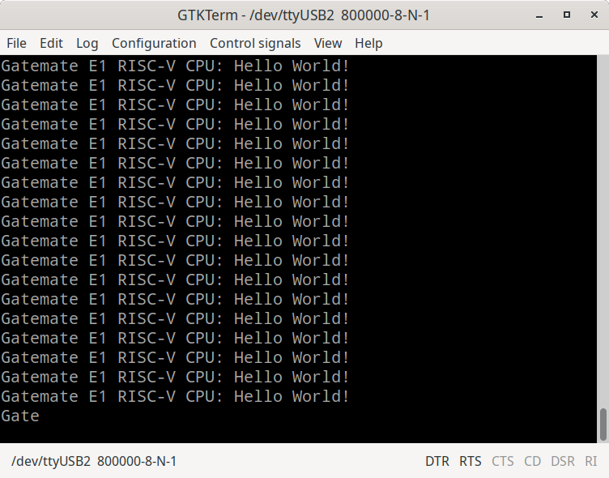

## Step20 - Gatemate RISC-V Tutorial

### Description

This folder is step20 of the popular FPGA tutorial ["From Blinker to RISCV"](https://github.com/BrunoLevy/learn-fpga/tree/master/FemtoRV/TUTORIALS/FROM_BLINKER_TO_RISCV) by BrunoLevy.

Step20 demonstrates the creation of a separate native RISC-V assembly program, and how run it from the FPGA BRAM. Two example  programs are saved in the subfolders src-blink and src-hello. By default, 'make' builds the src-blink' assemply program that simply blinks the onboard LED's. By using 'make hello', the second example program is built, which writes a "Hello World!" string to the UART.

### Build FPGA Bitstream

```
fm@nuc7fpga:~/fpga/projects/git/gatemate-riscv/step20$ make
make -C src-blink
make[1]: Entering directory '/mnt/hgfs/fpga/projects/git/gatemate-riscv/step20/src-blink'
...
/home/fm/fpga/projects/git/gatemate-riscv/riscv-toolchain/firmware_words/firmware_words blinker.bram.elf -ram 6144 -max_addr 6144 -out firmware.hex
   RAM SIZE=6144
   LOAD ELF: blinker.bram.elf
       max address=162
Code size: 40 words ( total RAM size: 1536 words )
Occupancy: 2%
testing MAX_ADDR limit: 6144
   max_addr OK
   SAVE HEX: firmware.hex
make[1]: Leaving directory '/mnt/hgfs/fpga/projects/git/gatemate-riscv/step20/src-blink'
cp src-blink/firmware.hex .
/home/fm/cc-toolchain-linux/bin/yosys/yosys -p 'read -sv SOC.v ../rtl-shared/clockworks.v ../rtl-shared/pll_gatemate.v ../rtl-shared/emmitter_uart.v; synth_gatemate -top SOC -vlog SOC_synth.v'


 /----------------------------------------------------------------------------\
 |                                                                            |
 |  yosys -- Yosys Open SYnthesis Suite                                       |
 |                                                                            |
 |  Copyright (C) 2012 - 2020  Claire Xenia Wolf <claire@yosyshq.com>         |
...
=== SOC ===

   Number of wires:                590
   Number of wire bits:           3187
   Number of public wires:          67
   Number of public wire bits:    1041
   Number of memories:               0
   Number of memory bits:            0
   Number of processes:              0
   Number of cells:               1214
     CC_ADDF                       170
     CC_BRAM_20K                     5
     CC_BUFG                         1
     CC_DFF                        106
     CC_IBUF                         3
     CC_LUT1                        37
     CC_LUT2                        50
     CC_LUT3                       388
     CC_LUT4                       444
     CC_OBUF                         9
     CC_PLL                          1
...
End of script. Logfile hash: d5749ba093, CPU: user 0.73s system 1.07s, MEM: 29.90 MB peak
Yosys 0.29+42 (git sha1 2004a9ff4, g++ 12.2.1 -Os)
Time spent: 30% 1x abc (0 sec), 14% 28x opt_expr (0 sec), ...
test -e ../gatemate-e1.ccf || exit
/home/fm/cc-toolchain-linux/bin/p_r/p_r -i SOC_synth.v -o SOC -ccf ../gatemate-e1.ccf +uCIO > SOC_pr.log
```
### Simulation
```
fm@nuc7fpga:~/fpga/projects/git/gatemate-riscv/step20$ make test
Running testbench simulation
test ! -e SOC.tb || rm SOC.tb
test ! -e SOC.vcd || rm SOC.vcd
/usr/bin/iverilog -DBENCH -o SOC.tb -s SOC_tb SOC_tb.v SOC.v ../rtl-shared/clockworks.v ../rtl-shared/pll_gatemate.v ../rtl-shared/emmitter_uart.v
/usr/bin/vvp SOC.tb
LEDS = 111xxxxx
LEDS = 11110101
LEDS = 11111010
LEDS = 11110101
LEDS = 11111010
LEDS = 11110101
LEDS = 11111010
LEDS = 11110101
LEDS = 11111010
^C** VVP Stop(0) **
** Flushing output streams.
** Current simulation time is 37906102 ticks.
> finish
** Continue **
```

### Board Programming
```
step20$ make prog
Programming E1 SPI Config:
/home/fm/cc-toolchain-linux/bin/openFPGALoader/openFPGALoader -b gatemate_evb_spi SOC_00.cfg
Jtag frequency : requested 6.00MHz   -> real 6.00MHz
Detail:
Jedec ID          : c2
memory type       : 28
memory capacity   : 17
EDID + CFD length : c2
EDID              : 1728
CFD               :
00
Detail:
Jedec ID          : c2
memory type       : 28
memory capacity   : 17
EDID + CFD length : c2
EDID              : 1728
CFD               :
flash chip unknown: use basic protection detection
Erasing: [==================================================] 100.00%
Done
Writing: [==================================================] 100.00%
Done
Wait for CFG_DONE DONE
```
### Output
With the UART assigned to the E1 boards PMODB connector pins, the Digilent PMOD-UART converter receives the RISC-V program output, and we can display it in a terminal window. The terminal output runs at a bitrate of 833.333, falling short of the UART target speed of 1Mbaud (1.000.000). The root cause is discussed in [Issue #3](https://github.com/fm4dd/gatemate-riscv/issues/3). Setting the GTKTerm port speed to baudrate 800.000 is sufficient.

