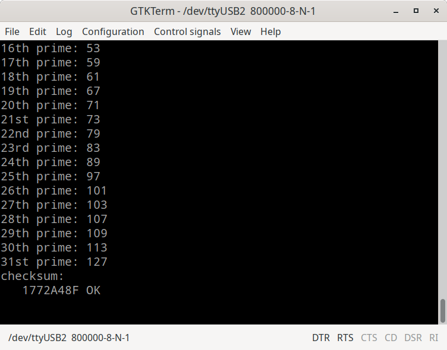

## Step21 - Gatemate RISC-V Tutorial

### Description

This folder is step21 of the popular FPGA tutorial ["From Blinker to RISCV"](https://github.com/BrunoLevy/learn-fpga/tree/master/FemtoRV/TUTORIALS/FROM_BLINKER_TO_RISCV) by BrunoLevy.

Step21 demonstrates how to compile a native RISC-V 'C' program, how to load and run it from the FPGA BRAM. The example  program sieve.c finds the first 31 prime numbers, and outputs the result to the UART.

### Build FPGA Bitstream

```
$ make
--- Building RISC-V Firmware ---
make -C src-sieve
make[1]: Entering directory '/mnt/hgfs/fpga/projects/git/gatemate-riscv/step21/src-sieve'
/home/fm/fpga/projects/git/gatemate-riscv/riscv-toolchain/bin/riscv64-unknown-elf-as -march=rv32i -mabi=ilp32 -mno-relax start.S -o start.o
/home/fm/fpga/projects/git/gatemate-riscv/riscv-toolchain/bin/riscv64-unknown-elf-as -march=rv32i -mabi=ilp32 -mno-relax wait.S -o wait.o
/home/fm/fpga/projects/git/gatemate-riscv/riscv-toolchain/bin/riscv64-unknown-elf-as -march=rv32i -mabi=ilp32 -mno-relax putchar.S -o putchar.o
/home/fm/fpga/projects/git/gatemate-riscv/riscv-toolchain/bin/riscv64-unknown-elf-gcc -march=rv32i -mabi=ilp32 -fno-pic -fno-stack-protector -w -Wl,--no-relax -c print.c -o print.o
/home/fm/fpga/projects/git/gatemate-riscv/riscv-toolchain/bin/riscv64-unknown-elf-gcc -march=rv32i -mabi=ilp32 -fno-pic -fno-stack-protector -w -Wl,--no-relax -c sieve.c -o sieve.o
/home/fm/fpga/projects/git/gatemate-riscv/riscv-toolchain/bin/riscv64-unknown-elf-ld start.o wait.o putchar.o print.o sieve.o /home/fm/fpga/projects/git/gatemate-riscv/riscv-toolchain/lib/gcc/riscv64-unknown-elf/8.3.0/rv32i/ilp32/libgcc.a -m elf32lriscv -nostdlib -norelax -T /home/fm/fpga/projects/git/gatemate-riscv/ldscripts-shared/bram.ld -o sieve.bram.elf
/home/fm/fpga/projects/git/gatemate-riscv/riscv-toolchain/firmware_words/firmware_words sieve.bram.elf -ram 6144 -max_addr 6144 -out firmware.hex
   RAM SIZE=6144
   LOAD ELF: sieve.bram.elf
       max address=3209
Code size: 802 words ( total RAM size: 1536 words )
Occupancy: 52%
testing MAX_ADDR limit: 6144
   max_addr OK
   SAVE HEX: firmware.hex
make[1]: Leaving directory '/mnt/hgfs/fpga/projects/git/gatemate-riscv/step21/src-sieve'
cp src-sieve/firmware.hex .
/home/fm/oss-cad-suite/bin/yosys -ql log/synth.log -p 'read -sv SOC.v ../rtl-shared/clockworks.v ../rtl-shared/pll_gatemate.v ../rtl-shared/emmitter_uart.v; synth_gatemate -top SOC -luttree -nomx8 -vlog net/SOC_synth.v; write_json net/SOC_synth.json'
test -e ../gatemate-e1.ccf || exit
/home/fm/oss-cad-suite/bin/nextpnr-himbaechel --device=CCGM1A1 --json net/SOC_synth.json --write net/SOC_impl.v -o out=net/SOC_impl.txt -o ccf=../gatemate-e1.ccf --router router2 > log/impl.log
Info: Using uarch 'gatemate' for device 'CCGM1A1'
Info: Using timing mode 'WORST'
Info: Using operation mode 'SPEED'
...
Info: Device utilisation:
Info: 	            USR_RSTN:       0/      1     0%
Info: 	            CPE_COMP:       0/  20480     0%
Info: 	         CPE_CPLINES:       7/  20480     0%
Info: 	               IOSEL:      12/    162     7%
Info: 	                GPIO:      12/    162     7%
Info: 	               CLKIN:       1/      1   100%
Info: 	              GLBOUT:       1/      1   100%
Info: 	                 PLL:       1/      4    25%
Info: 	            CFG_CTRL:       0/      1     0%
Info: 	              SERDES:       0/      1     0%
Info: 	              CPE_LT:    2059/  40960     5%
Info: 	              CPE_FF:     109/  40960     0%
Info: 	           CPE_RAMIO:     499/  40960     1%
Info: 	            RAM_HALF:       5/     64     7%
...
Info: Program finished normally.
/home/fm/oss-cad-suite/bin/gmpack --input net/SOC_impl.txt --bit SOC.bit
```
### Simulation

iVerilog:
```
$ make test
Running testbench simulation
test ! -e SOC.tb || rm SOC.tb
test ! -e SOC.vcd || rm SOC.vcd
/home/fm/oss-cad-suite/bin/iverilog -DBENCH -o SOC.tb -s SOC_tb SOC_tb.v SOC.v ../rtl-shared/clockworks.v ../rtl-shared/pll_gatemate.v ../rtl-shared/emmitter_uart.v
/home/fm/oss-cad-suite/bin/vvp SOC.tb
 1st prime: 2
 2nd prime: 3
 3rd prime: 5
 4th prime: 7
 5th prime: 11
 6th prime: 13
 7th prime: 17
 8th prime: 19
 9th prime: 23
10th prime: 29
11th prime: 31
12th prime: 37
13th prime: 41
14th prime: 43
15th prime: 47
16th prime: 53
17th prime: 59
18th prime: 61
19th prime: 67
20th prime: 71
21st prime: 73
22nd prime: 79
23rd prime: 83
24th prime: 89
25th prime: 97
26th prime: 101
27th prime: 103
28th prime: 107
29th prime: 109
30th prime: 113
31st prime: 127
checksum:
   1772A48F OK
[BENCH] Checksum OK detected. Terminating simulation.
SOC.v:409: $finish called at 1109934 (1s)
```

Verilator:
```
$ make vtest
Running verilator testbench simulation
test ! -d ./obj_dir || rm -rf ./obj_dir
/home/fm/oss-cad-suite/bin/verilator -DBENCH -Wno-fatal --top-module SOC --cc --exe SOC.cpp SOC.v ../rtl-shared/clockworks.v ../rtl-shared/pll_gatemate.v ../rtl-shared/emmitter_uart.v SOC_tb.v
- V e r i l a t i o n   R e p o r t: Verilator 5.045 devel rev v5.044-221-g702d6ede0 (mod)
- Verilator: Built from 0.148 MB sources in 9 modules, into 0.131 MB in 6 C++ files needing 0.000 MB
- Verilator: Walltime 0.083 s (elab=0.007, cvt=0.035, bld=0.000); cpu 0.042 s on 1 threads; allocated 21.301 MB
(cd obj_dir; make -f VSOC.mk)
make[1]: Entering directory '/mnt/hgfs/fpga/projects/git/gatemate-riscv/step21/obj_dir'
g++  -I.  -MMD -I/home/fm/oss-cad-suite/share/verilator/include -I/home/fm/oss-cad-suite/share/verilator/include/vltstd -DVERILATOR=1 -DVM_COVERAGE=0 -DVM_SC=0 -DVM_TIMING=0 -DVM_TRACE=0 -DVM_TRACE_FST=0 -DVM_TRACE_VCD=0 -DVM_TRACE_SAIF=0 -faligned-new -fcf-protection=none -Wno-bool-operation -Wno-int-in-bool-context -Wno-shadow -Wno-sign-compare -Wno-subobject-linkage -Wno-tautological-compare -Wno-uninitialized -Wno-unused-but-set-parameter -Wno-unused-but-set-variable -Wno-unused-parameter -Wno-unused-variable      -Os  -c -o SOC.o ../SOC.cpp
g++ -Os  -I.  -MMD -I/home/fm/oss-cad-suite/share/verilator/include -I/home/fm/oss-cad-suite/share/verilator/include/vltstd -DVERILATOR=1 -DVM_COVERAGE=0 -DVM_SC=0 -DVM_TIMING=0 -DVM_TRACE=0 -DVM_TRACE_FST=0 -DVM_TRACE_VCD=0 -DVM_TRACE_SAIF=0 -faligned-new -fcf-protection=none -Wno-bool-operation -Wno-int-in-bool-context -Wno-shadow -Wno-sign-compare -Wno-subobject-linkage -Wno-tautological-compare -Wno-uninitialized -Wno-unused-but-set-parameter -Wno-unused-but-set-variable -Wno-unused-parameter -Wno-unused-variable      -c -o verilated.o /home/fm/oss-cad-suite/share/verilator/include/verilated.cpp
g++ -Os  -I.  -MMD -I/home/fm/oss-cad-suite/share/verilator/include -I/home/fm/oss-cad-suite/share/verilator/include/vltstd -DVERILATOR=1 -DVM_COVERAGE=0 -DVM_SC=0 -DVM_TIMING=0 -DVM_TRACE=0 -DVM_TRACE_FST=0 -DVM_TRACE_VCD=0 -DVM_TRACE_SAIF=0 -faligned-new -fcf-protection=none -Wno-bool-operation -Wno-int-in-bool-context -Wno-shadow -Wno-sign-compare -Wno-subobject-linkage -Wno-tautological-compare -Wno-uninitialized -Wno-unused-but-set-parameter -Wno-unused-but-set-variable -Wno-unused-parameter -Wno-unused-variable      -c -o verilated_threads.o /home/fm/oss-cad-suite/share/verilator/include/verilated_threads.cpp
python3 /home/fm/oss-cad-suite/share/verilator/bin/verilator_includer -DVL_INCLUDE_OPT=include VSOC.cpp VSOC___024root__0.cpp VSOC__ConstPool__0__Slow.cpp VSOC___024root__Slow.cpp VSOC___024root__0__Slow.cpp VSOC__Syms__Slow.cpp > VSOC__ALL.cpp
g++ -Os  -I.  -MMD -I/home/fm/oss-cad-suite/share/verilator/include -I/home/fm/oss-cad-suite/share/verilator/include/vltstd -DVERILATOR=1 -DVM_COVERAGE=0 -DVM_SC=0 -DVM_TIMING=0 -DVM_TRACE=0 -DVM_TRACE_FST=0 -DVM_TRACE_VCD=0 -DVM_TRACE_SAIF=0 -faligned-new -fcf-protection=none -Wno-bool-operation -Wno-int-in-bool-context -Wno-shadow -Wno-sign-compare -Wno-subobject-linkage -Wno-tautological-compare -Wno-uninitialized -Wno-unused-but-set-parameter -Wno-unused-but-set-variable -Wno-unused-parameter -Wno-unused-variable      -c -o VSOC__ALL.o VSOC__ALL.cpp
g++    SOC.o verilated.o verilated_threads.o VSOC__ALL.a    -pthread -lpthread -latomic   -o VSOC
rm VSOC__ALL.verilator_deplist.tmp
make[1]: Leaving directory '/mnt/hgfs/fpga/projects/git/gatemate-riscv/step21/obj_dir'
test -e obj_dir/VSOC && obj_dir/VSOC || echo 'Make failed, no obj_dir/VSOC found!'
LEDS: 11111
 1st prime: 2
 2nd prime: 3
 3rd prime: 5
 4th prime: 7
 5th prime: 11
 6th prime: 13
 7th prime: 17
 8th prime: 19
 9th prime: 23
10th prime: 29
11th prime: 31
12th prime: 37
13th prime: 41
14th prime: 43
15th prime: 47
16th prime: 53
17th prime: 59
18th prime: 61
19th prime: 67
20th prime: 71
21st prime: 73
22nd prime: 79
23rd prime: 83
24th prime: 89
25th prime: 97
26th prime: 101
27th prime: 103
28th prime: 107
29th prime: 109
30th prime: 113
31st prime: 127
checksum:
   1772A48F OK
[BENCH] Checksum OK detected. Terminating simulation.
- SOC.v:409: Verilog $finish
```

### Board Programming
```
$ make prog
Programming E1 SPI Config:
/home/fm/oss-cad-suite/bin/openFPGALoader  -b gatemate_evb_spi SOC.bit
empty
Jtag frequency : requested 6.00MHz    -> real 6.00MHz   
JEDEC ID: 0xc22817
Detected: Macronix MX25R6435F 128 sectors size: 64Mb
00000000 00000000 00000000 00
start addr: 00000000, end_addr: 00020000
Erasing: [==================================================] 100.00%
Done
Writing: [==================================================] 100.00%
Done
Wait for CFG_DONE DONE
```
### Output
With the UART assigned to the E1 boards PMODB connector pins, the Digilent PMOD-UART converter receives the RISC-V program output, and we can display it in a terminal window.



The original code had a bug that set the baud rate to 833.333, falling short of the UART target speed of 1Mbaud (1.000.000).
This issue as been resolved in [Issue #3](https://github.com/fm4dd/gatemate-riscv/issues/3). 

The serial port works at the intended baud rate:
```
$ ./terminal.sh 
picocom v3.1

port is        : /dev/ttyUSB2
flowcontrol    : none
baudrate is    : 1000000
parity is      : none
databits are   : 8
stopbits are   : 1
escape is      : C-a
local echo is  : no
noinit is      : no
noreset is     : no
hangup is      : no
nolock is      : no
send_cmd is    : ascii-xfr -s -l 30 -n
receive_cmd is : rz -vv -E
imap is        : crcrlf,lfcrlf,
omap is        : crlf,delbs,
emap is        : crcrlf,delbs,
logfile is     : none
initstring     : none
exit_after is  : not set
exit is        : no

Type [C-a] [C-h] to see available commands
Terminal ready

 1st prime: 2
 2nd prime: 3
 3rd prime: 5
 4th prime: 7
 5th prime: 11
 6th prime: 13
 7th prime: 17
 8th prime: 19
 9th prime: 23
10th prime: 29
11th prime: 31
12th prime: 37
13th prime: 41
14th prime: 43
15th prime: 47
16th prime: 53
17th prime: 59
18th prime: 61
19th prime: 67
20th prime: 71
21st prime: 73
22nd prime: 79
23rd prime: 83
24th prime: 89
25th prime: 97
26th prime: 101
27th prime: 103
28th prime: 107
29th prime: 109
30th prime: 113
31st prime: 127
checksum:
   1772A48F OK
```

