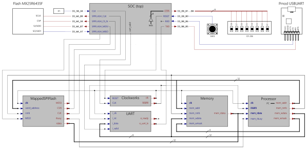
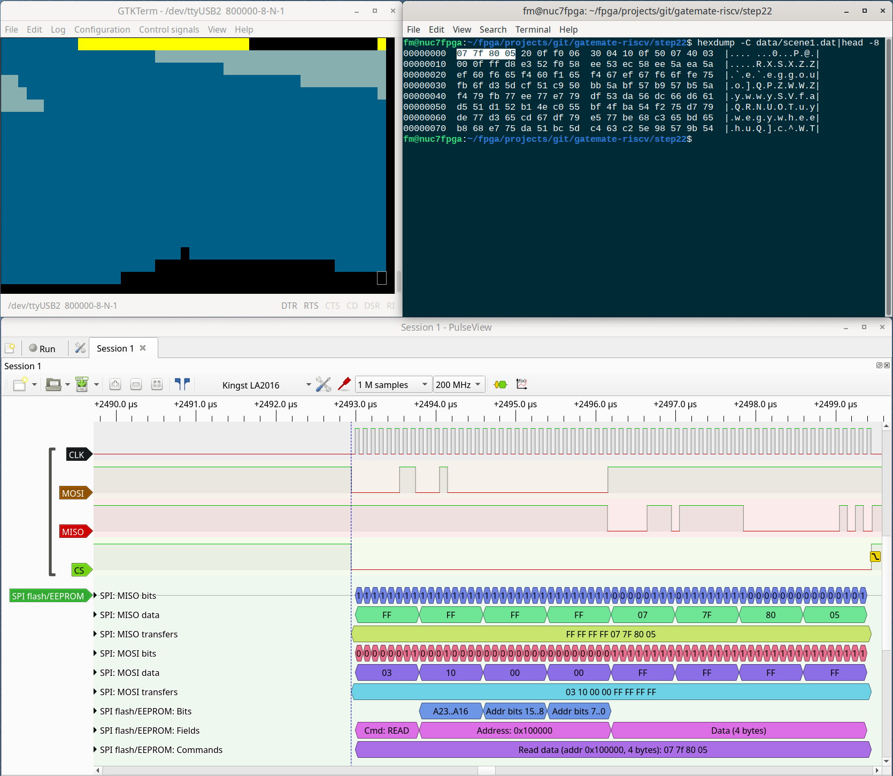

## Step22 - Gatemate RISC-V Tutorial

### Description

This folder is step22 of the popular FPGA tutorial ["From Blinker to RISCV"](https://github.com/BrunoLevy/learn-fpga/tree/master/FemtoRV/TUTORIALS/FROM_BLINKER_TO_RISCV) by BrunoLevy.

Step22 loads the [ST-NICCC megademo](https://www.pouet.net/prod.php?which=1251) 'C' program into BRAM, and introduces data read from the FPGA flash storage. The ST-NICCC megademo data file scene1.dat gets stored into the Gatemate FPGA flash at 1M offset (above the FPGA bitstream) during programming. The FPA code runs the ST-NICCC megademo program that reads the scene data from flash, and outputs it as ASCII pseudo-graphic to the UART.

A big "Thank You" goes to g3grau for taking the time to troubleshoot and solve the initial SPI flash access problems I had in [issue2](https://github.com/fm4dd/gatemate-riscv/issues/2).

### Module design:


A new module spi_flash.v is added to read data from the Gatemate E1 onboard flash memory.

### Build FPGA Bitstream

```
fm@nuc7fpga:~/fpga/projects/git/gatemate-riscv/step22$ make
make -C src
make[1]: Entering directory '/mnt/hgfs/fpga/projects/git/gatemate-riscv/step22/src'
...
/home/fm/fpga/projects/git/gatemate-riscv/riscv-toolchain/firmware_words/firmware_words ST_NICCC.bram.elf -ram 6144 -max_addr 6144 -out firmware.hex
   RAM SIZE=6144
   LOAD ELF: ST_NICCC.bram.elf
       max address=5723
Code size: 1430 words ( total RAM size: 1536 words )
Occupancy: 93%
testing MAX_ADDR limit: 6144
   max_addr OK
   SAVE HEX: firmware.hex
make[1]: Leaving directory '/mnt/hgfs/fpga/projects/git/gatemate-riscv/step22/src'
cp src/firmware.hex .
/home/fm/cc-toolchain-linux/bin/yosys/yosys -p 'read -sv SOC.v ../rtl-shared/clockworks.v ../rtl-shared/pll_gatemate.v ../rtl-shared/emmitter_uart.v ../rtl-shared/spi_flash.v; synth_gatemate -top SOC -vlog SOC_synth.v'

 /----------------------------------------------------------------------------\
 |                                                                            |
 |  yosys -- Yosys Open SYnthesis Suite                                       |
 |                                                                            |
 |  Copyright (C) 2012 - 2020  Claire Xenia Wolf <claire@yosyshq.com>         |
...
=== SOC ===

   Number of wires:                640
   Number of wire bits:           3339
   Number of public wires:          83
   Number of public wire bits:    1217
   Number of memories:               0
   Number of memory bits:            0
   Number of processes:              0
   Number of cells:               1301
     CC_ADDF                       167
     CC_BRAM_20K                     5
     CC_BUFG                         1
     CC_DFF                        172
     CC_IBUF                         4
     CC_LUT1                        32
     CC_LUT2                        52
     CC_LUT3                       407
     CC_LUT4                       416
     CC_MX4                         32
     CC_OBUF                        12
     CC_PLL                          1
...
End of script. Logfile hash: 2c6ae4eb7a, CPU: user 0.93s system 0.90s, MEM: 30.13 MB peak
Yosys 0.29+42 (git sha1 2004a9ff4, g++ 12.2.1 -Os)
Time spent: 27% 1x abc (0 sec), 14% 28x opt_expr (0 sec), ...
test -e ../gatemate-e1.ccf || exit
/home/fm/cc-toolchain-linux/bin/p_r/p_r -i SOC_synth.v -o SOC -ccf ../gatemate-e1.ccf +uCIO > SOC_pr.log
```

### Board Programming
```
fm@nuc7fpga:~/fpga/projects/git/gatemate-riscv/step22$ make prog
Programming scene data at 1M offset:
/home/fm/cc-toolchain-linux/bin/openFPGALoader/openFPGALoader -b gatemate_evb_spi -o 1048576 data/scene1.dat -f
write to flash
Jtag frequency : requested 6.00MHz   -> real 6.00MHz  
Detail: 
Jedec ID          : c2
memory type       : 28
memory capacity   : 17
EDID + CFD length : c2
EDID              : 1728
CFD               : 
00
Detail: 
Jedec ID          : c2
memory type       : 28
memory capacity   : 17
EDID + CFD length : c2
EDID              : 1728
CFD               : 
flash chip unknown: use basic protection detection
Erasing: [==================================================] 100.00%
Done
Writing: [==================================================] 100.00%
Done
Wait for CFG_DONE DONE
Programming E1 SPI Config:
/home/fm/cc-toolchain-linux/bin/openFPGALoader/openFPGALoader -b gatemate_evb_spi -f SOC_00.cfg.bit
write to flash
Jtag frequency : requested 6.00MHz   -> real 6.00MHz  
Detail: 
Jedec ID          : c2
memory type       : 28
memory capacity   : 17
EDID + CFD length : c2
EDID              : 1728
CFD               : 
00
Detail: 
Jedec ID          : c2
memory type       : 28
memory capacity   : 17
EDID + CFD length : c2
EDID              : 1728
CFD               : 
flash chip unknown: use basic protection detection
Erasing: [==================================================] 100.00%
Done
Writing: [==================================================] 100.00%
Done
Wait for CFG_DONE DONE
```
### Output
With the UART assigned to the E1 boards PMODB connector pins, the Digilent PMOD-UART converter receives the RISC-V program output, and we can display it in a terminal window. The terminal output runs at a bitrate of 833.333, falling short of the UART target speed of 1Mbaud (1.000.000). The root cause is discussed in [Issue #3](https://github.com/fm4dd/gatemate-riscv/issues/3).


This screenshot shows the GTKTERM output, and the first 4 bytes of the SPI flash read operation as seen by the protocol analyzer which I connected to the Gatemate J3 header. The SPI clock speed = CPU clock speed: 10Mhz. Currently the flash data is read by using the slowest SPI read mode. With additional work, we can optimize clock speed and use more efficient SPI read modes.

#### Gatemate E1  Flash Operation

During troubleshooting of the SPI flash access I checked the Gatemate flash programming and boot operation with a protocol analyzer. I saved my notes in this gist: https://gist.github.com/fm4dd/2af1e45aadc3aac8290ac3127ab45e72


