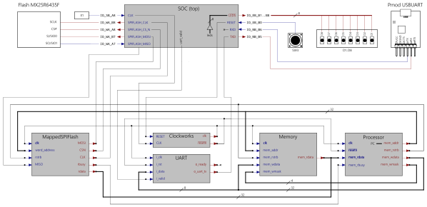
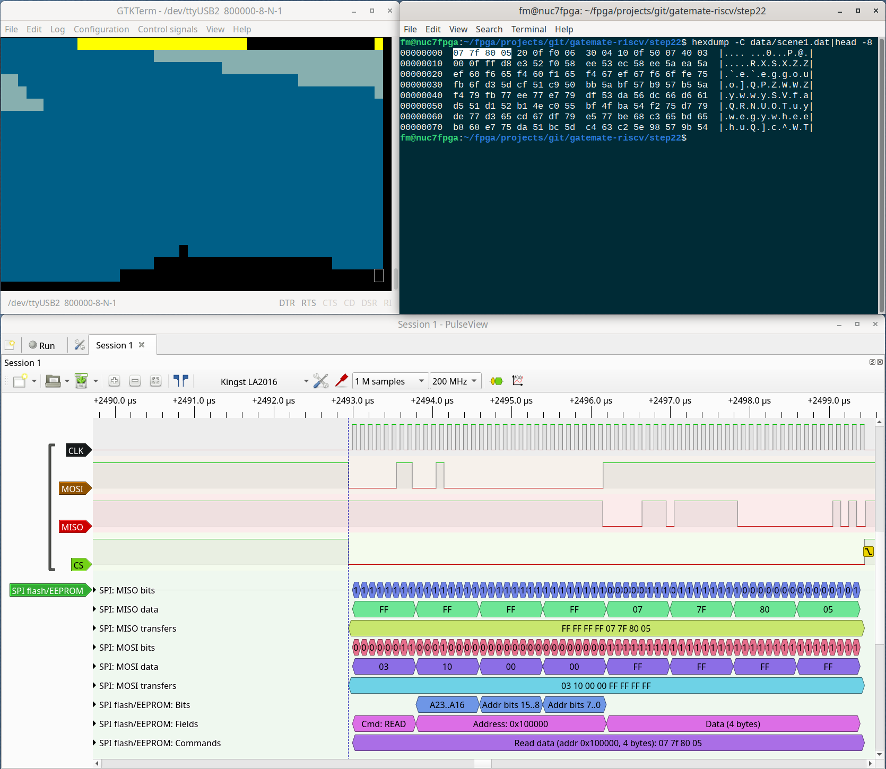

## Step22 - Gatemate RISC-V Tutorial

### Description

**Note** This step does not work yet. There is a issue with the Verilog flash driver and the Gatemate E1 board. This is discussed in [Issue 2]().

This folder is step22 of the popular FPGA tutorial ["From Blinker to RISCV"](https://github.com/BrunoLevy/learn-fpga/tree/master/FemtoRV/TUTORIALS/FROM_BLINKER_TO_RISCV) by BrunoLevy.

Step22 loads the [ST-NICCC megademo](https://www.pouet.net/prod.php?which=1251) 'C' program into BRAM, and introduces data read from the FPGA flash storage. The ST-NICCC megademo data file scene1.dat gets stored into the Gatemate FPGA flash at 1M offset (above the FPGA bitstream) during programming. The FPA code runs the ST-NICCC megademo program that reads the scene data from flash, and outputs it as ASCII pseudo-graphic to the UART.

A big "Thank You" goes to g3grau for taking the time to troubleshoot and solve the initial SPI flash access problems I had in [issue2](https://github.com/fm4dd/gatemate-riscv/issues/2).

The C-program needs optimizer flag -O2 to fit into 6K BRAM. This 6KB limit came from the original project, which was written for Lattice ICE40HX1K FPGA. That FPGA chip got 16 blocks of 4kBit BRAM (16x512 bytes) for a total of 8KB. I think the project used 6KB and left 4 blocks/2KB for other functions. Gatemate CCGM1A1 got 32 blocks of 40k, giving us a total of 160KB. We may expand the space to 64KB or even 128KB in `/ldscripts-shared/bram.ld` and `src/start.S`. To be tested, see [readme_start-S.md](src/readme_start-S.md).

### Module design:


A new module spi_flash.v is added to read data from the Gatemate E1 onboard flash memory.

### Build FPGA Bitstream

```
$ make
Makefile:29: warning: overriding recipe for target 'prog'
../config.mk:76: warning: ignoring old recipe for target 'prog'
--- Building RISC-V Firmware ---
make -C src
make[1]: Entering directory '/mnt/hgfs/fpga/projects/git/gatemate-riscv/step22/src'
/home/fm/fpga/projects/git/gatemate-riscv/riscv-toolchain/bin/riscv64-unknown-elf-as -march=rv32i -mabi=ilp32 -mno-relax start.S -o start.o
/home/fm/fpga/projects/git/gatemate-riscv/riscv-toolchain/bin/riscv64-unknown-elf-as -march=rv32i -mabi=ilp32 -mno-relax putchar.S -o putchar.o
/home/fm/fpga/projects/git/gatemate-riscv/riscv-toolchain/bin/riscv64-unknown-elf-gcc -march=rv32i -mabi=ilp32 -fno-pic -fno-stack-protector -w -Wl,--no-relax -O2 -c print.c -o print.o
/home/fm/fpga/projects/git/gatemate-riscv/riscv-toolchain/bin/riscv64-unknown-elf-gcc -march=rv32i -mabi=ilp32 -fno-pic -fno-stack-protector -w -Wl,--no-relax -O2 -c ST_NICCC.c -o ST_NICCC.o
/home/fm/fpga/projects/git/gatemate-riscv/riscv-toolchain/bin/riscv64-unknown-elf-ld start.o putchar.o print.o ST_NICCC.o /home/fm/fpga/projects/git/gatemate-riscv/riscv-toolchain/lib/gcc/riscv64-unknown-elf/8.3.0/rv32i/ilp32/libgcc.a -m elf32lriscv -nostdlib -norelax -T /home/fm/fpga/projects/git/gatemate-riscv/ldscripts-shared/bram.ld -o firmware.bram.elf
/home/fm/fpga/projects/git/gatemate-riscv/riscv-toolchain/firmware_words/firmware_words firmware.bram.elf -ram 6144 -max_addr 6144 -out firmware.hex
   RAM SIZE=6144
   LOAD ELF: firmware.bram.elf
       max address=5723
Code size: 1430 words ( total RAM size: 1536 words )
Occupancy: 93%
testing MAX_ADDR limit: 6144
   max_addr OK
   SAVE HEX: firmware.hex
make[1]: Leaving directory '/mnt/hgfs/fpga/projects/git/gatemate-riscv/step22/src'
cp src/firmware.hex .
/home/fm/oss-cad-suite/bin/yosys -ql log/synth.log -p 'read -sv SOC.v ../rtl-shared/clockworks.v ../rtl-shared/pll_gatemate.v ../rtl-shared/emmitter_uart.v ../rtl-shared/spi_flash.v; synth_gatemate -top SOC -luttree -nomx8 -vlog net/SOC_synth.v; write_json net/SOC_synth.json'
test -e ../gatemate-e1.ccf || exit
/home/fm/oss-cad-suite/bin/nextpnr-himbaechel --device=CCGM1A1 --json net/SOC_synth.json --write net/SOC_impl.v -o out=net/SOC_impl.txt -o ccf=../gatemate-e1.ccf --router router2 > log/impl.log
Info: Using uarch 'gatemate' for device 'CCGM1A1'
Info: Using timing mode 'WORST'
Info: Using operation mode 'SPEED'
...
Info: Device utilisation:
Info: 	            USR_RSTN:       0/      1     0%
Info: 	            CPE_COMP:       0/  20480     0%
Info: 	         CPE_CPLINES:       9/  20480     0%
Info: 	               IOSEL:      16/    162     9%
Info: 	                GPIO:      16/    162     9%
Info: 	               CLKIN:       1/      1   100%
Info: 	              GLBOUT:       1/      1   100%
Info: 	                 PLL:       1/      4    25%
Info: 	            CFG_CTRL:       0/      1     0%
Info: 	              SERDES:       0/      1     0%
Info: 	              CPE_LT:    2098/  40960     5%
Info: 	              CPE_FF:     175/  40960     0%
Info: 	           CPE_RAMIO:     502/  40960     1%
Info: 	            RAM_HALF:       5/     64     7%
...
Info: Program finished normally.
/home/fm/oss-cad-suite/bin/gmpack --input net/SOC_impl.txt --bit SOC.bit
```

### Board Programming

The data upload to flash is doine before we program the board. The extra flash step is added via the local Makefile, which overwrites the standard `make prog` from `config.mk`.
```
$ make prog
Makefile:28: warning: overriding recipe for target 'prog'
../config.mk:76: warning: ignoring old recipe for target 'prog'
Programming scene data at 1M offset (1048576 bytes):
/home/fm/oss-cad-suite/bin/openFPGALoader -b gatemate_evb_spi -o 1048576 data/scene1.dat -f
empty
write to flash
Jtag frequency : requested 6.00MHz    -> real 6.00MHz   

JEDEC ID: 0xc22817
Detected: Macronix MX25R6435F 128 sectors size: 64Mb
00100000 00000000 00000000 00
start addr: 00100000, end_addr: 001a0000
Erasing: [==================================================] 100.00%
Done
Writing: [==================================================] 100.00%
Done
Wait for CFG_DONE DONE
Programming E1 SPI Config:
/home/fm/oss-cad-suite/bin/openFPGALoader -b gatemate_evb_spi -f SOC.bit
empty
write to flash
Jtag frequency : requested 6.00MHz    -> real 6.00MHz   
JEDEC ID: 0xc22817
Detected: Macronix MX25R6435F 128 sectors size: 64Mb
00000000 00000000 00000000 00
start addr: 00000000, end_addr: 00020000
Erasing: [==================================================] 100.00%
Done
Writing: [==================================================] 100.00%
Done
Wait for CFG_DONE DONE

```
### Output
With the UART assigned to the E1 boards PMODB connector pins, the Digilent PMOD-UART converter receives the RISC-V program output, and we can display the serial output in a terminal window.

The original code had a bug that set the baud rate to 833.333, falling short of the UART target speed of 1Mbaud (1.000.000).
This issue as been resolved in [Issue #3](https://github.com/fm4dd/gatemate-riscv/issues/3).



This screenshot shows the GTKTERM output, and the first 4 bytes of the SPI flash read operation as seen by the protocol analyzer which I connected to the Gatemate J3 header. The SPI clock speed = CPU clock speed: 10Mhz. Currently the flash data is read by using the slowest SPI read mode. With additional work, we can optimize clock speed and use more efficient SPI read modes.

#### Gatemate E1  Flash Operation

During troubleshooting of the SPI flash access I checked the Gatemate flash programming and boot operation with a protocol analyzer. I saved my notes in this gist: https://gist.github.com/fm4dd/2af1e45aadc3aac8290ac3127ab45e72


The serial output should show an animation on the terminal, however my output looks different from the original project.
It is supposed to look like this:
.
Possibly the serial baud rate is too slow...
