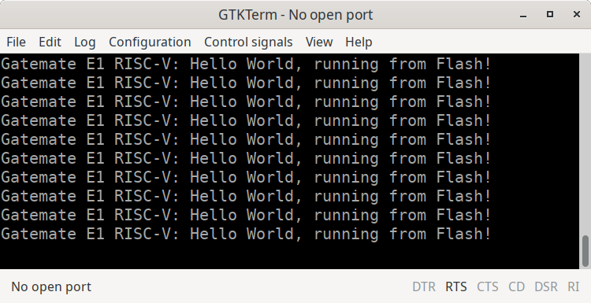

## Step23 - Gatemate RISC-V Tutorial

### Description

This folder is step23 of the popular FPGA tutorial ["From Blinker to RISCV"](https://github.com/BrunoLevy/learn-fpga/tree/master/FemtoRV/TUTORIALS/FROM_BLINKER_TO_RISCV) by BrunoLevy.

Step23 demonstrates how to load and run a native RISC-V 'C' program from SPI Flash. This is needed for larger programs that do not fit into the limited internal RAM of an FPGA. As an example program we re-use the same "Hello World" example program from step20.

#### Constraints

To use the onboard flash device from Verilog, we need below pin location constraints in our CCF file. The most important setting is to use `DRIVE=9` on the SPI clock pin `IO_WA_B8`. It Sets Pin `IO_WA_B8` to 9mA drive strength. This overcomes the pulldown resistor and create a sufficient sharp rising edge signal. [gatemate-e1.ccf](https://github.com/fm4dd/gatemate-riscv/blob/main/gatemate-e1.ccf)

```
## #######################################################
## E1 onboard SPI Flash Memory
## SPI clock signal on pin IO_WA_B8 requires DRIVE=9 or 12
## #######################################################
Pin_out "SPIFLASH_CLK"   Loc = "IO_WA_B8" | DRIVE=9;
Pin_out "SPIFLASH_CS_N"  Loc = "IO_WA_A8";
Pin_out "SPIFLASH_MOSI"  Loc = "IO_WA_B7";
Pin_in  "SPIFLASH_MISO"  Loc = "IO_WA_A7";
```

#### Code Updates
In this step, the author adds the following code changes to run a program from flash:

##### 1. Update the `WAIT_INSTR` state SOC.v
To load code from the SPI flash, we must stay in WAIT_INSTR state until mem_rbusy is zero, indicating the flash data has beel loaded. In Verilog, a test for mem_rbusy is added as a condition before jumping to state EXECUTE:

```
   WAIT_INSTR: begin
      instr <= mem_rdata[31:2];
      rs1 <= RegisterBank[mem_rdata[19:15]];
      rs2 <= RegisterBank[mem_rdata[24:20]];
      if(!mem_rbusy) state <= EXECUTE;
   end
```

##### 2. Initialize BRAM to jump to address 0x00900000

Address 0x00900000 corresponds to the address where the SPI flash is projected into the address space of our CPU (0x00800000 = 1 << 23), plus an offset of 1MB (0x100000). This 1MB offset is necessary because we share the SPI Flash with the FPGA. The original project had a 128kB flash offset. This was to low for Gatemate, which needs more space for the Gatemate FPGA bitstream placed at the beginning of the Flash.

```
`include "../rtl-shared/riscv_assembly.v"
   initial begin
      LI(a0,32'h00900000);
      JR(a0);
   end
```

Note: Verilog needs to include the assembly instructions in ../rtl-shared/riscv_assembly.v.

##### 3. Use a dedicated linker script for the RISC-V program

It is saved into [ldscripts-shared/spiflash0.ld](https://github.com/fm4dd/gatemate-riscv/blob/main/ldscripts-shared/spiflash0.ld):
```
MEMORY {
   /* ------------------------------------------------------------------------------------------- */
   /* This section defines the physical layout of the target                                      */
   /* FLASH - defines a memory region named "FLASH"                                               */
   /* (RX) - sets memory as Read-only and eXecutable (typical for code stored in flash)           */
   /* ORIGIN = 0x00900000: start address. Flash is mapped to start at 9MB into the address space. */
   /* LENGTH = 0x100000: This is the size of the region set as 1MB.                               */
   /* ------------------------------------------------------------------------------------------- */
   FLASH (RX)  : ORIGIN = 0x00900000, LENGTH = 0x100000
}
SECTIONS {
   /* ------------------------------------------------------------------------------------------- */
   /* everything : creates an output section "everything"                                         */
   /*  . = ALIGN(4);: ensures the current location counter is aligned to a 4-byte boundary.       */
   /*                 Most CPUs require instructions to be word-aligned.                          */
   /* start.o (.text): instructs to put the .text section (the actual executable code) from the   */
   /*                  file start.o first. Ensures entry point is at the beginning of the flash.  */
   /* *(.*): This "catch-all" wildcard tells the linker to take all sections from all other input */
   /*        files and bundle them here (e.g. code, read-only data, any other defined segments).  */
   /* >FLASH - This tells linker to put "everthing" into FLASH memory                             */
   /* ------------------------------------------------------------------------------------------- */
    everything : {
	. = ALIGN(4);
	start.o (.text)
        *(.*)
    } >FLASH
}
```
##### 4. In src-hello/hello.S, set section as "read-only"

We run "XIP" (eXecute In Place) from Flash. Setting `.section .rodata` (Read-Only Data) in hello.S tells the assembler/linker that the string is a constant and stays in the Flash memory.

```
.section .rodata
hello:
	.asciz "Gatemate E1 RISC-V: Hello World, running from Flash!\n"
```

##### 5. RISC-V SoC Memory Map

| Base Address | End Address  | Size   | Target Device      | Access | Description                                              |
|:-------------|:-------------|:-------|:-------------------|:-------|:---------------------------------------------------------|
| `0x00000000` | `0x000017FF` | 6 KiB  | **Internal RAM**   | RW     | Bootloader, Stack Space (SP init: `0x17FC`)              |
| `0x00400004` | `0x00400007` | 4 B    | **GPIO LEDs**      | W      | `IO_LEDS` offset (Gatemate E1 LED D1..D8)                |
| `0x00400008` | `0x0040000B` | 4 B    | **UART Data**      | W      | `IO_UART_DAT` Transmit register, puchar writes here      |
| `0x00400010` | `0x00400013` | 4 B    | **UART Control**   | R      | `IO_UART_CNTL` (Bit 9: Busy status, checked by putchar)  |
| `0x00900000` | `0x009FFFFF` | 1 MiB  | **SPI Flash**      | RX     | Firmware/Code (Entry point `0x00900000`) Flash storage   |

**Notes:**
* **GP (Global Pointer):** Initialized to `0x00400000` for I/O access.
* **SP (Stack Pointer):** Initialized to `0x000017FC` (grows downwards).
* **Execution:** Hardware boots at `0x0`, runs Verilog-defined `LI/JR` bootloader, then jumps to Flash.1

### Build FPGA Bitstream

```
$ make
Makefile:30: warning: overriding recipe for target 'prog'
../config.mk:76: warning: ignoring old recipe for target 'prog'
--- Building RISC-V Firmware ---
make -C src-hello
make[1]: Entering directory '/mnt/hgfs/fpga/projects/git/gatemate-riscv/step23/src-hello'
/home/fm/fpga/projects/git/gatemate-riscv/riscv-toolchain/bin/riscv64-unknown-elf-as -march=rv32i -mabi=ilp32 -mno-relax start.S -o start.o
/home/fm/fpga/projects/git/gatemate-riscv/riscv-toolchain/bin/riscv64-unknown-elf-as -march=rv32i -mabi=ilp32 -mno-relax wait.S -o wait.o
/home/fm/fpga/projects/git/gatemate-riscv/riscv-toolchain/bin/riscv64-unknown-elf-as -march=rv32i -mabi=ilp32 -mno-relax putchar.S -o putchar.o
/home/fm/fpga/projects/git/gatemate-riscv/riscv-toolchain/bin/riscv64-unknown-elf-as -march=rv32i -mabi=ilp32 -mno-relax hello.S -o hello.o
/home/fm/fpga/projects/git/gatemate-riscv/riscv-toolchain/bin/riscv64-unknown-elf-ld start.o wait.o putchar.o hello.o -m elf32lriscv -nostdlib -norelax -T /home/fm/fpga/projects/git/gatemate-riscv/ldscripts-shared/spiflash0.ld -o hello.spiflash.elf
/home/fm/fpga/projects/git/gatemate-riscv/riscv-toolchain/bin/riscv64-unknown-elf-objcopy hello.spiflash.elf firmware.bin -O binary
make[1]: Leaving directory '/mnt/hgfs/fpga/projects/git/gatemate-riscv/step23/src-hello'
cp src-hello/firmware.bin .
/home/fm/oss-cad-suite/bin/yosys -ql log/synth.log -p 'read -sv SOC.v ../rtl-shared/clockworks.v ../rtl-shared/pll_gatemate.v ../rtl-shared/emmitter_uart.v ../rtl-shared/spi_flash.v; synth_gatemate -top SOC -luttree -nomx8 -vlog net/SOC_synth.v; write_json net/SOC_synth.json'
test -e ../gatemate-e1.ccf || exit
/home/fm/oss-cad-suite/bin/nextpnr-himbaechel --device=CCGM1A1 --json net/SOC_synth.json --write net/SOC_impl.v -o out=net/SOC_impl.txt -o ccf=../gatemate-e1.ccf --router router2 > log/impl.log
Info: Using uarch 'gatemate' for device 'CCGM1A1'
Info: Using timing mode 'WORST'
Info: Using operation mode 'SPEED'
...
Info: Device utilisation:
Info: 	            USR_RSTN:       0/      1     0%
Info: 	            CPE_COMP:       0/  20480     0%
Info: 	         CPE_CPLINES:      10/  20480     0%
Info: 	               IOSEL:      16/    162     9%
Info: 	                GPIO:      16/    162     9%
Info: 	               CLKIN:       1/      1   100%
Info: 	              GLBOUT:       1/      1   100%
Info: 	                 PLL:       1/      4    25%
Info: 	            CFG_CTRL:       0/      1     0%
Info: 	              SERDES:       0/      1     0%
Info: 	              CPE_LT:    2132/  40960     5%
Info: 	              CPE_FF:     193/  40960     0%
Info: 	           CPE_RAMIO:     502/  40960     1%
Info: 	            RAM_HALF:       5/     64     7%
...
Info: Program finished normally.
/home/fm/oss-cad-suite/bin/gmpack --input net/SOC_impl.txt --bit SOC.bit
```
### Simulation

This step has no specific simulation.

### Board Programming
```
$ make prog
Makefile:30: warning: overriding recipe for target 'prog'
../config.mk:76: warning: ignoring old recipe for target 'prog'
Loading RISC-V program to Flash at 1M offset (1048576 bytes):
/home/fm/oss-cad-suite/bin/openFPGALoader -b gatemate_evb_spi -o 1048576 -f firmware.bin
empty
write to flash
Jtag frequency : requested 6.00MHz    -> real 6.00MHz
JEDEC ID: 0xc22817
Detected: Macronix MX25R6435F 128 sectors size: 64Mb
00100000 00000000 00000000 00
start addr: 00100000, end_addr: 00110000
Erasing: [==================================================] 100.00%
Done
Writing: [==================================================] 100.00%
Done
Wait for CFG_DONE DONE
Programming E1 SPI Config:
/home/fm/oss-cad-suite/bin/openFPGALoader -b gatemate_evb_spi -f SOC.bit
empty
write to flash
Jtag frequency : requested 6.00MHz    -> real 6.00MHz
JEDEC ID: 0xc22817
Detected: Macronix MX25R6435F 128 sectors size: 64Mb
00000000 00000000 00000000 00
start addr: 00000000, end_addr: 00020000
Erasing: [==================================================] 100.00%
Done
Writing: [==================================================] 100.00%
Done
Wait for CFG_DONE DONE
```
### Output
With the UART assigned to the E1 boards PMODB connector pins, the Digilent PMOD-UART converter receives the RISC-V program output, and we can display it in a terminal window.

```
fm@nuc7fpga:/mnt/hgfs/fpga/projects/git/gatemate-riscv/step23$ ./terminal.sh
Gatemate E1 RISC-V: Hello World, running from Flash!
Gatemate E1 RISC-V: Hello World, running from Flash!
Gatemate E1 RISC-V: Hello World, running from Flash!
Gatemate E1 RISC-V: Hello World, running from Flash!
Gatemate E1 RISC-V: Hello World, running from Flash!
```
Example UART output in GTKTerm (we need the GTKTerm setting "Configuration -> CR LF auto"):

