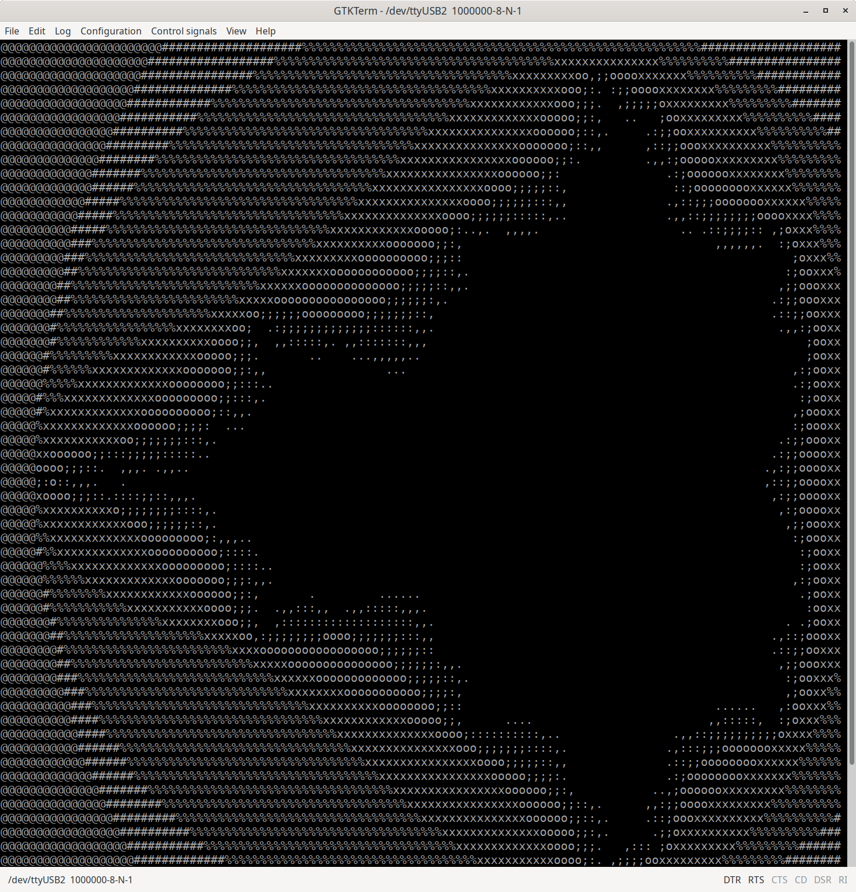

## Step24 - Gatemate RISC-V Tutorial

### Description

This folder is step24 of the popular FPGA tutorial ["From Blinker to RISCV"](https://github.com/BrunoLevy/learn-fpga/tree/master/FemtoRV/TUTORIALS/FROM_BLINKER_TO_RISCV) by BrunoLevy.

Step24 continues to run programs from SPI Flash while improving the linker script by correctly mapping code and variable sections to run larger programs. It relocates the stack data that until now was kept in the 6 kB of internal FPGA RAM.


#### Code Updates

##### 1. Update the `resetn` to jump to the flash program
In this step, the author reconfigures the reset button to make the CPU jump to flash memory each time reset is pressed. Before it jumped to address 0, which may no longer have the initial "jump-to-flash" instruction.

old:
```
   if(!resetn) begin
     PC    <= 0;
     state <= FETCH_INSTR;
   end
```
new:
```
   if(!resetn) begin
     PC    <= 32'h00900000; // 1MB flash storage offset location for RISC-V programs
     state <= WAIT_DATA;
   end
```
##### 2. First linker script improvements: spiflash1.ld and start_spiflash1.S

Here the author creates a new linker script to send code and variable initialization to SPI flash, variables to RAM. Specifically, it defines the following:
* text sections go to the flash memory
* bss sections go to BRAM
* data sections go to BRAM, but have their initial values stored in the flash memory

```
  MEMORY {
      FLASH (rx)  : ORIGIN = 0x00900000, LENGTH = 0x100000 // 1MB
      RAM   (rwx) : ORIGIN = 0x00000000, LENGTH = 0x1800   // 6KB
  }
  SECTIONS {

    .data: AT(address_in_spi_flash) {
      *(.data*)
      *(.sdata*)
    } > RAM

    .text : {
      start_spiflash1.o(.text)
      *(.text*)
      *(.rodata*)
      *(.srodata*)
    } >FLASH

    .bss : {
      *(.bss*)
      *(.sbss*)
    } >RAM
  }
```

Each section indicates how to map sections read from object files to sections in the executable (.data, .text and .bss), and how to map these sections either to the flash memory or to BRAM. For data, linker scripts can specify a LMA (Load Memory Address) that indicates where initial values need to be stored. The `AT` keyword indicates the LMA to put the initial values. Readonly data (.rodata and .srodata) is also put into the flash.

The improved linker file is [ldscripts-shared/spiflash1.ld](../ldscripts-shared/spiflash1.ld).

This linker setup requires a manually created startup file start_spiflash1.S. It contains the info to copy initialization data from the flash into BRAM, initialize uninitialized data (BSS) to zero.

This step 24-A is tested with the earlier Mandelbrot example from step18. The new startup file is in [src-mandel/start_piflash1.S](src-mandel/start_piflash1.S).

We can build the firmware with `make mandel`. After `make prog`, we can start the terminal program with `./terminal.sh`.
The program as a wait function at the beginning to let us catch up with the terminal command.
After a few seconds, the terminal output starts drawing the mandelbrot ASCII image line by line.

##### 3. Next linker script improvements: moving critical functions to BRAM

Some parts of code still run not fast enough from flash, and putting them into RAM greatly impoves the performance.

Below new linker configuration puts specific functions integer multiply and divide from libgcc, and the IO functions into fast RAM. The linker will put the code for these functions in the same section as the initialization data for initialized variables. Our runtime program in start_spiflash1.S will copy them together with the initialization data into RAM at startup time.

```
  .data_and_fastcode : AT ( _sidata ) {
        . = ALIGN(4);
        _sdata = .;

	/* Initialized data */
        *(.data*)
        *(.sdata*)

	/* integer mul and div */
	*/libgcc.a:muldi3.o(.text)
	*/libgcc.a:div.o(.text)

	putchar.o(.text)
	print.o(.text)

	/* functions with attribute((section(".fastcode"))) */
	*(.fastcode*)

        . = ALIGN(4);
        _edata = .;
    } > RAM
```

Note the line `*(.fastcode*)` allows to add other assembly functions in BRAM by setting their section as .fastcode. 
For C-functions, we can force the section name in source code like this:

```
 void my_function(my args ...) __attribute((section(".fastcode")));
 void my_function(my args ...) {
      ...
 }
```

This step 24-B is tested with a C-program that computes the first 36 digits of PI, available in [src-pi/pi.c](sirc-pi/pi.c).  The updated linker file is [ldscripts-shared/spiflash2.ld](../ldscripts-shared/spiflash2.ld).

Notice the compiled firmware.bin is 19K!

We can build the firmware for Pi with `make pi`. After `make prog`, we can start the terminal program with `./terminal.sh`.
The program as a wait function at the beginning to let us catch up with the terminal command.
After a few seconds, the terminal output starts sending the digits of Pi coming in blocks of 10 until we get to 36 places.

### Build FPGA Bitstream

```
$ make
Makefile:30: warning: overriding recipe for target 'prog'
../config.mk:76: warning: ignoring old recipe for target 'prog'
--- Building RISC-V Firmware ---
make -C src-mandel
make[1]: Entering directory '/mnt/hgfs/fpga/projects/git/gatemate-riscv/step24/src-mandel'
/home/fm/fpga/projects/git/gatemate-riscv/riscv-toolchain/bin/riscv64-unknown-elf-as -march=rv32i -mabi=ilp32 -mno-relax mandelbrot.S -o mandelbrot.o
/home/fm/fpga/projects/git/gatemate-riscv/riscv-toolchain/bin/riscv64-unknown-elf-ld start_spiflash1.o wait.o putchar.o mandelbrot.o -m elf32lriscv -nostdlib -norelax -T /home/fm/fpga/projects/git/gatemate-riscv/ldscripts-shared/spiflash1.ld /home/fm/fpga/projects/git/gatemate-riscv/riscv-toolchain/lib/gcc/riscv64-unknown-elf/8.3.0/rv32i/ilp32/libgcc.a -o mandel.spiflash.elf
/home/fm/fpga/projects/git/gatemate-riscv/riscv-toolchain/bin/riscv64-unknown-elf-objcopy mandel.spiflash.elf firmware.bin -O binary
make[1]: Leaving directory '/mnt/hgfs/fpga/projects/git/gatemate-riscv/step24/src-mandel'
cp src-mandel/firmware.bin .
/home/fm/oss-cad-suite/bin/yosys -ql log/synth.log -p 'read -sv SOC.v ../rtl-shared/clockworks.v ../rtl-shared/pll_gatemate.v ../rtl-shared/emmitter_uart.v ../rtl-shared/spi_flash.v; synth_gatemate -top SOC -luttree -nomx8 -vlog net/SOC_synth.v; write_json net/SOC_synth.json'
test -e ../gatemate-e1.ccf || exit
/home/fm/oss-cad-suite/bin/nextpnr-himbaechel --device=CCGM1A1 --json net/SOC_synth.json --write net/SOC_impl.v -o out=net/SOC_impl.txt -o ccf=../gatemate-e1.ccf --router router2 > log/impl.log
Info: Using uarch 'gatemate' for device 'CCGM1A1'
Info: Using timing mode 'WORST'
Info: Using operation mode 'SPEED'
...
Info: Device utilisation:
Info: 	            USR_RSTN:       0/      1     0%
Info: 	            CPE_COMP:       0/  20480     0%
Info: 	         CPE_CPLINES:       9/  20480     0%
Info: 	               IOSEL:      16/    162     9%
Info: 	                GPIO:      16/    162     9%
Info: 	               CLKIN:       1/      1   100%
Info: 	              GLBOUT:       1/      1   100%
Info: 	                 PLL:       1/      4    25%
Info: 	            CFG_CTRL:       0/      1     0%
Info: 	              SERDES:       0/      1     0%
Info: 	              CPE_LT:    2072/  40960     5%
Info: 	              CPE_FF:     175/  40960     0%
Info: 	           CPE_RAMIO:     502/  40960     1%
Info: 	            RAM_HALF:       5/     64     7%
...
Info: Program finished normally.
/home/fm/oss-cad-suite/bin/gmpack --input net/SOC_impl.txt --bit SOC.bit
```
### Simulation

This step has no specific simulation.

### Board Programming
```
Makefile:30: warning: overriding recipe for target 'prog'
../config.mk:76: warning: ignoring old recipe for target 'prog'
Loading RISC-V program to Flash at 1M offset (1048576 bytes):
/home/fm/oss-cad-suite/bin/openFPGALoader -b gatemate_evb_spi -o 1048576 -f firmware.bin
empty
write to flash
Jtag frequency : requested 6.00MHz    -> real 6.00MHz   
JEDEC ID: 0xc22817
Detected: Macronix MX25R6435F 128 sectors size: 64Mb
00100000 00000000 00000000 00
start addr: 00100000, end_addr: 00110000
Erasing: [==================================================] 100.00%
Done
Writing: [==================================================] 100.00%
Done
Wait for CFG_DONE DONE
Programming E1 SPI Config:
/home/fm/oss-cad-suite/bin/openFPGALoader -b gatemate_evb_spi -f SOC.bit
empty
write to flash
Jtag frequency : requested 6.00MHz    -> real 6.00MHz   
JEDEC ID: 0xc22817
Detected: Macronix MX25R6435F 128 sectors size: 64Mb
00000000 00000000 00000000 00
start addr: 00000000, end_addr: 00020000
Erasing: [==================================================] 100.00%
Done
Writing: [==================================================] 100.00%
Done
Wait for CFG_DONE DONE
```
### Output

Example UART output for the RISC-V Mandelbrot program in step 24-A, created with `make mandel`, `make prog` and `./terminal.sh`:
```
$ ./terminal.sh 
@@@@@@@@@@@@@@@@@@@@@@@####################%%%%%%%%%%%%%%%%%%%%%%%%%%%%%%%%%%%%%%%%%%%%%%%%%%%%%%%%%####################
@@@@@@@@@@@@@@@@@@@@@##################%%%%%%%%%%%%%%%%%%%%%%%%%%%%%%%%%%%%%%%%xxxxxxxxxxxxxxx%%%%%%%%%%################
@@@@@@@@@@@@@@@@@@@@################%%%%%%%%%%%%%%%%%%%%%%%%%%%%%%%%%%%%%xxxxxxxxxoo,;;ooooxxxxxxx%%%%%%%%%%############
@@@@@@@@@@@@@@@@@@@##############%%%%%%%%%%%%%%%%%%%%%%%%%%%%%%%%%%%%%xxxxxxxxxxooo;:. :;;ooooxxxxxxxx%%%%%%%%%#########
@@@@@@@@@@@@@@@@@@############%%%%%%%%%%%%%%%%%%%%%%%%%%%%%%%%%%%%%xxxxxxxxxxxxooo;;;.  ,;;;;;oxxxxxxxxx%%%%%%%%%#######
@@@@@@@@@@@@@@@@@###########%%%%%%%%%%%%%%%%%%%%%%%%%%%%%%%%%%%%xxxxxxxxxxxxxooooo;;:,   ..   ;ooxxxxxxxxx%%%%%%%%%%####
@@@@@@@@@@@@@@@@##########%%%%%%%%%%%%%%%%%%%%%%%%%%%%%%%%%%%xxxxxxxxxxxxxxxoooooo;::,.     .:;;ooxxxxxxxxxx%%%%%%%%%%##
@@@@@@@@@@@@@@@#########%%%%%%%%%%%%%%%%%%%%%%%%%%%%%%%%%%%xxxxxxxxxxxxxxxooooooo;::,,      ,::;;oooxxxxxxxxxx%%%%%%%%%%
@@@@@@@@@@@@@@########%%%%%%%%%%%%%%%%%%%%%%%%%%%%%%%%%%%xxxxxxxxxxxxxxxxoooooo;;:.         .,,:;oooooxxxxxxxxx%%%%%%%%%
```
With the UART assigned to the E1 boards PMODB connector pins, the Digilent PMOD-UART converter receives the RISC-V program output, and we can display it in a terminal window. A button press on SWI3 resets the RISC-V program execution and restarts the Mandelbrot display.

Example UART output in GTKTerm (we need the GTKTerm setting "Configuration -> CR LF auto"):


Example UART output for the RISC-V Pi program in step 24-B, created with `make pi`, `make prog` and `./terminal.sh`:

```
$ ./terminal.sh 
Gatemate E1 RISC-V: Calculating PI...
pi = 3.141592653589793238462643383279502884197169399
Gatemate E1 RISC-V: ...finished after 37 rounds.
```
